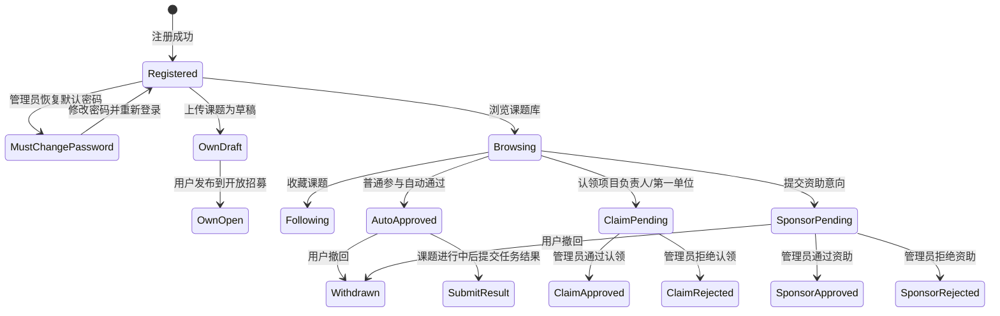
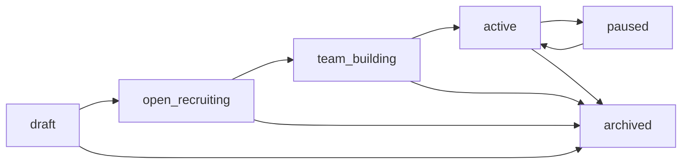
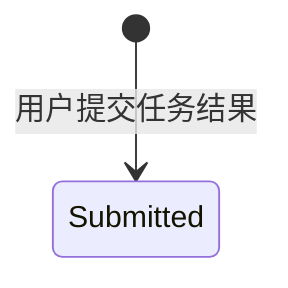

# AGENTS.md - OpenMedAI Lab Agent 开工导航与系统基准文档

更新时间：2026-06-18

文件位置：项目根目录 `AGENTS.md`

代码基准：以当前仓库代码为准；若本文档与当前代码冲突，必须先核对代码，再同步修正文档。

当前产品版本文件：`VERSION = 0.13.1`

本文档用途：后续任何 agent 在执行任何任务前，必须先读本文档，再按“任务定位索引”打开必要代码文件。目标是避免每次从零通读完整仓库，同时保证生命周期、API、数据库、权限和前端入口不被改乱。

本文档不是一次性 PR 说明，也不是替代代码的绝对真相。若本文档与当前代码冲突，必须先核对代码，再同步修正文档。

## 1. Agent 使用方式

每次接到新任务时，按下面顺序执行：

1. 读本文档，确认任务属于哪个模块。
2. 在“任务定位索引”中找到对应文件和函数区域。
3. 只优先阅读相关文件，不要默认通读整个仓库。
4. 修改前确认是否会影响生命周期、API、数据库、权限、版本号或对外文案。
5. 修改后按本文档给出的测试矩阵验收。
6. 如果改动改变了系统规则、接口语义、数据模型、前端入口或验收方式，必须同步更新本文档。

快速判断：

| 如果任务提到 | 先读本文哪些部分 |
| --- | --- |
| 登录、注册、密码、管理员账户 | 2.1、3、4.1、5.1、7.1 |
| 课题库、课题详情、进度页、讨论区、搜索筛选、状态卡 | 2.2、3.3、4.2、5.2、6.1 |
| 用户上传课题、编辑课题、每日限制 | 2.3、3.2、3.3、4.3、5.2 |
| 收藏、参与、认领、资助、撤回 | 2.4、3.4、4.4、5.3 |
| 个人中心、我的任务、任务结果 | 2.5、3.5、4.5、6.2 |
| 管理员工作台、任务审批、任务管理、系统入口、备份恢复 | 2.6、3.5、4.6、6.3 |
| 主题、主题排序、数据集说明 PDF、课题 PDF、进度 PDF | 2.7、3.6、4.7、5.2 |
| 审计日志、异常、请求 ID | 2.8、3.7、4.8、5.5 |
| 常见问答、二维码展示、弹窗遮挡、响应式、顶部导航、悬浮卡 | 2.9、6、7.3 |
| 版本号、更新日志弹窗 | 2.10、8 |

## 2. 任务定位索引

本节是最重要的开工地图。后续 agent 应先在这里定位，再去读代码。

### 2.1 用户、注册、登录、管理员、密码

| 目的 | 主要文件 | 重点位置 |
| --- | --- | --- |
| 用户资料模型、UID、管理员 UID、在线统计 | `accounts/models.py` | `PLATFORM_ADMIN_UID`、`ROLE_UID_PREFIXES`、`UserProfile`、`uid_for_user`、邮箱规范化、`last_seen_at` |
| 注册表单和邮箱唯一性 | `accounts/forms.py` | `RegisterForm`、`UserProfileForm` |
| 默认密码恢复 | `accounts/services.py` | `get_system_default_password`、`reset_user_to_default_password` |
| 唯一管理员维护 | `accounts/management/commands/ensure_platform_admin.py` | 固定 `platform_admin`、`ADM00000001`，禁止多个管理员 |
| 传统 Django 页面 | `accounts/views.py`、`accounts/urls.py` | 目前应跳转 SPA，不作为主产品入口扩展 |
| 登录/注册/强制改密 API | `api/ninja_api.py` | `register`、`login_view`、`logout_view`、`password_change_required`、`profile_get/profile_patch/profile_put`、`admin_user_reset_password` |
| 强制改密和在线心跳 | `api/middleware.py` | `PasswordChangeRequiredMiddleware`、`LastSeenMiddleware` |
| 用户序列化 | `api/serializers.py` | `user_payload`、`uid_only_user_payload`、`profile_payload`、`admin_user_detail_payload` |
| 前端 API 包装 | `frontend/src/api.js` | `login`、`register`、`changeRequiredPassword`、`profile`、`adminResetUserPassword` |
| 前端页面逻辑 | `frontend/src/main.js` | 登录、注册、强制改密、资料页、用户管理相关函数 |
| 样式 | `frontend/src/styles.css` | 登录卡片、表单、弹窗、用户管理表格 |
| 测试 | `accounts/tests.py`、`api/tests.py`、`frontend/src/api.test.js`、`frontend/src/profileMenu.test.js` | 注册失败路径、管理员唯一、强制改密、CSRF、个人菜单 |

产品规则：

- 管理员唯一：`platform_admin` / `ADM00000001`。
- 密码恢复不走邮箱；管理员恢复为系统统一默认密码。
- 用户用默认密码登录后必须先改密并重新登录。
- 不恢复邮箱验证、邮箱重置密码、自助找回密码。
- 在线人数按最近 5 分钟内有请求活动的已登录注册用户统计；匿名访客不计入，同一用户多会话只计 1 人。
- `UserProfile.last_seen_at` 只用于聚合在线统计，不进入用户资料、管理员用户详情、审计摘要或公开 payload。

### 2.2 公开课题库、课题详情、搜索筛选、状态卡

| 目的 | 主要文件 | 重点位置 |
| --- | --- | --- |
| 课题和阶段模型 | `projects/models.py` | `ProjectStage`、`Project`、`ProjectTag`、`ProjectDocument`、`ProjectProgressEntry`、`ProjectDiscussion` |
| 公开课题 API | `api/ninja_api.py` | `project_list`、`project_detail`、`project_progress`、`project_status_card`、`project_discussion_list/create/update/delete`、`theme_datasets` |
| 搜索和可见性辅助 | `api/ninja_api.py` | `project_search_q`、`related_project_search_q`、`viewer_state`、`status_uid_groups_for_project` |
| 课题序列化 | `api/serializers.py` | `project_summary_payload`、`project_detail_payload`、`public_project_detail_payload`、`project_progress_payload`、`discussion_payload`、`theme_dataset_payload` |
| 前端课题库加载 | `frontend/src/main.js` | `loadProjects`、`projectListRequestParams`、`loadProjectProgress`、`loadProjectDiscussions`、首页主题栏 |
| 前端状态卡 | `frontend/src/main.js`、`frontend/src/styles.css` | 状态卡渲染、组队/阶段/资助颜色、悬浮定位、小屏防遮挡 |
| 测试 | `api/tests.py`、`frontend/src/uiPlacement.test.js` | 公开过滤、状态卡 UID 分组、主题栏、状态颜色、响应式 |

产品规则：

- 访客和普通公开列表只能看到 `is_public = true` 且阶段为开放招募、组队中、进行中、暂停的课题。
- 已登录用户读取公开课题列表时，每个课题应带 `viewer_state`，用于从数据库恢复收藏、点赞、参与、认领、资助等按钮状态；已撤回关系不能继续算作当前激活状态。
- 公开课题列表默认按课题编号 `topic_id` 正序；“最新编号”按 `topic_id` 倒序；“最近更新”才按 `updated_at` 排序，避免编辑课题打乱编号顺序。
- 草稿和归档不进入公开课题库、公开详情、公开课题进度页、公开讨论区和公开主题数据集说明。
- 首页主题入口直接一行展示所有启用主题：第一个入口固定为“不限主题”，不再提供“展示全部主题/收起全部主题”展开功能。
- 首页选中主题后，课题列表上方的主题大标题如存在数据集说明 PDF，应悬停提示“点击查看该主题的数据集说明文件”，点击后新标签页打开该 PDF。
- 状态卡展示阶段、我的关系、按收藏/参与/认领/资助分组的 UID；登录态课题列表还可返回创建者和组队角色联系人姓名/微信。
- 涉及他人信息时，公开访客只展示 UID；登录用户可在首页组队悬浮卡查看成员姓名和微信，但不得暴露邮箱。
- 课题卡片组队 `0/1`、`1/1`、`2/1 · 超额` 必须保留文字；未满足、刚好满足、超额、进行中阶段、已获资助状态用不同语义颜色区分。
- 课题标题进入 `#/project/{id}` 独立进度页；主 PDF 仍通过单独查看/下载入口打开。
- 公开课题进度页只返回公开且未归档课题、公开进度文档、公开进度记录和可见讨论；作者、上传者只展示 UID。
- 讨论区访客可读，登录用户可写主讨论和回复；作者可编辑/删除自己的讨论，管理员可隐藏/恢复/删除，讨论写操作必须写审计。

### 2.3 用户上传课题、管理员课题管理、Markdown/JSON 导入

| 目的 | 主要文件 | 重点位置 |
| --- | --- | --- |
| 课题字段和上传者 | `projects/models.py` | `Project.created_by`、阶段、公开状态、文档关系 |
| Markdown/导入解析 | `projects/importing.py`、`projects/contracts.py` | 课题模板字段、导入契约 |
| 用户课题 API | `api/ninja_api.py` | `me_project_list`、`user_project_create`、`user_project_update`、`user_project_delete` |
| 用户课题 PDF API | `api/ninja_api.py` | `user_project_document_upload`、`user_project_document_delete`、`require_user_project_document_access` |
| 管理员课题 API | `api/ninja_api.py` | `admin_project_list`、`admin_project_get`、`admin_project_create`、`admin_project_update`、`admin_project_delete`、`admin_project_bulk_archive`、`admin_project_bulk_action`、`admin_project_import_json` |
| 课题写入校验 | `api/ninja_api.py` | `ProjectWriteRequest`、`validate_admin_project_payload`、`validate_user_project_payload`、`require_project_owner_or_admin`、`user_project_uploads_today`、`user_can_bypass_project_upload_quota` |
| 前端用户上传 | `frontend/src/main.js` | `loadMyProjects`、新增/编辑我的课题表单、保存草稿/发布、`setMyProjectDocumentFile`、`deleteMyProjectDocument` |
| 前端管理员课题管理 | `frontend/src/main.js` | `loadAdminProjects`、课题列表、状态下拉、新增/编辑课题弹窗、上传主 PDF、上传项目进度 PDF |
| 前端 API 包装 | `frontend/src/api.js` | `meProjects`、`createProject`、`updateProject`、`deleteProject`、`uploadProjectDocuments`、`deleteProjectDocument`、`adminProjects`、`adminCreateProject`、`adminUpdateProject`、`adminDeleteProject` |
| 测试 | `api/tests.py`、`projects/tests.py`、`frontend/src/projectJsonImport.test.js` | ownership、每日 10 个、草稿发布、课题 PDF、导入校验 |

产品规则：

- 管理员和普通用户都可以上传课题。
- 普通用户只能修改或删除自己上传的课题。
- 普通用户每天最多上传 10 个课题；管理员不受限制。
- 用户上传课题默认草稿；用户只允许在草稿和开放招募之间切换。
- 普通用户可为自己上传的非归档课题上传、替换或删除一份主 PDF；非 owner 不可操作，归档课题只能管理员改。
- 管理员可以管理全站课题，可推进阶段、暂停、归档。
- 管理端课题归档和删除必须分开：归档通过 `PATCH /api/admin/projects/{id}/` 设置 `stage=archived,is_public=false`，不需要确认；删除通过 `DELETE /api/admin/projects/{id}/` 物理删除课题，前端必须弹确认。
- JSON 导入接口当前仍存在于代码中；若任务要求移除或隐藏，必须先确认前端入口、测试和历史数据影响。
- 导入/批量操作必须展示成功数、失败数和失败原因。

### 2.4 收藏、点赞、参与、认领、资助、撤回

| 目的 | 主要文件 | 重点位置 |
| --- | --- | --- |
| 关系模型 | `interactions/models.py` | `ProjectFollow`、`ProjectScore`、`ProjectInterest`、`ProjectClaimIntent`、`ClaimType` |
| 关系服务 | `interactions/services.py` | 自动通过、状态变更、约束逻辑 |
| 关系 API | `api/ninja_api.py` | `follow_project`、`unfollow_project`、`score_project`、`unscore_project`、`interest_project`、`claim_project`、`sponsor_project`、`me_interaction_withdraw`、`admin_interaction_list`、`admin_interaction_update_status` |
| 状态辅助 | `api/ninja_api.py` | `maybe_advance_project_stage_after_interaction`、`user_has_approved_project_relation`、`viewer_state`、`claim_availability_payload` |
| 关系序列化 | `api/serializers.py` | `interest_payload`、`claim_payload`、`sponsor_payload`、`follow_payload`、`dashboard_payload` |
| 前端操作 | `frontend/src/main.js` | `submitLike`、`submitInterest`、`submitParticipationRequest`、`submitClaim`、`submitLeadClaim`、`submitPaperClaim`、`submitSponsor`、`withdrawInteraction` |
| 测试 | `api/tests.py`、`interactions/tests.py` | 自动通过、资助审批、撤回、阶段限制、UID 展示 |

产品规则：

- 收藏是用户关系，不是课题阶段，不推进课题生命周期。
- 点赞是轻量反馈，不推进课题生命周期。
- 普通参与提交后自动 `approved`，不进入管理员审批；参与时必须选择论文署名意向。
- 认领项目负责人和认领课题（论文第一单位）提交后为 `pending`，需要管理员审批，审核意见必须返回给申请人；其他兼容认领类型仍按旧逻辑自动通过。
- 本人认领处于 `pending` 时，课题卡按钮必须显示 `项目负责人审批中` 或 `第一单位认领审批中`，只展示审批中提示，不展示撤回认领入口；只有同类型认领 `approved` 后，课题卡才显示 `撤回项目负责人认领` 或 `撤回论文第一单位认领`。
- 同一课题同一时间最多只能有 1 个 active 项目负责人认领和 1 个 active 论文第一单位认领；active 指 `pending` 或 `approved`，`withdrawn` 和 `rejected` 不占用席位。提交和管理员审批都必须校验该规则，数据库也应有条件唯一约束兜底。
- 论文第一单位认领必须填写结构化字段 `claimed_unit_name`，不能只把第一单位名称写入自由文本 `message`；历史旧数据可兼容展示，但新提交必须保存结构化字段。
- 首页课题卡参与按钮文案为“参与/取消参与”；取消参与不弹确认，参与、取消参与、认领项目负责人/论文第一单位和撤回具体认领成功后必须局部刷新该课题组队状态，不刷新整个页面。未知身份或旧 `role=其他` 的参与记录按学生组队桶兜底展示，避免用户点击参与后组队数量无变化。
- 面向用户的认领撤回文案必须写清具体类型：`撤回项目负责人认领`、`撤回论文第一单位认领`，不能只写“撤回认领”或“撤回第一单位”。
- 无法认领时，前端必须展示鼠标/焦点附近的小提示或移动端 toast，原因来自 `claim_availability`，覆盖未登录、阶段原因、已有认领、积分不足和数据冲突。
- 资助意向提交后为 `pending`，只由管理员审批为 `approved` 或 `rejected`；课题卡主入口使用贴近按钮的多选 popover，主选项为资助劳务费和资助算力，可多选；资助 token 仍需保留用户可到达入口。
- 用户可撤回自己的关系，撤回状态为 `withdrawn`。
- 参与/认领/资助只允许在开放招募和组队中提交。
- 任一参与或认领通过后，课题可进入组队中；当前自动推进逻辑集中在后端辅助函数中，改动前必须确认产品需求。
- 参与和认领提交前必须检查可用积分额度：余额扣除未启动但已占用的 50 分参与额度后，仍需至少剩余 50 分。
- 登录用户公开课题库按本人关系优先展示：后端必须在分页前按 `我已认领`、`我已参与`、`我已资助`、无关系的优先级排序，再应用当前编号/更新/热度排序；多关系时首页课题库卡片只显示一个金色斜角主标签，其余本人关系以金色小标签显示在课题编号前。本人相关课题 hover 顶线为金色。

### 2.5 个人中心、我的任务、任务结果

| 目的 | 主要文件 | 重点位置 |
| --- | --- | --- |
| 任务结果模型 | `credits/models.py` | `Contribution`、`ContributionStatus`、`CreditLedger` |
| 用户任务结果 API | `api/ninja_api.py` | `me_task_list`、`me_contribution_list`、`me_contribution_create`、`me_contribution_upload` |
| 提交资格校验 | `api/ninja_api.py` | `user_has_approved_project_relation`、课题阶段校验 |
| 序列化 | `api/serializers.py` | `contribution_payload`、`dashboard_payload` |
| 前端个人中心 | `frontend/src/main.js` | `loadDashboard`、`loadFavorites`、`loadMyProjects`、`openContributionModal`、`submitContribution` |
| 样式 | `frontend/src/styles.css` | 个人中心面板、任务弹窗、响应式 |
| 测试 | `api/tests.py`、`frontend/src/uiPlacement.test.js` | 提交资格、弹窗不遮挡、小屏适配 |

产品规则：

- “我的任务”不是旧 `ProjectTask` 分配任务，而是用户与课题之间的已收藏、已申请、已认领、已资助、已提交结果状态汇总。
- 用户只有在课题为进行中，且自己有已通过参与或认领关系时，才能提交任务结果。
- 单纯资助关系不赋予任务结果提交资格。
- 任务结果提交后即为 `submitted`，不进入管理员审批主流程。
- 提交结果可只填写说明内容，也可额外上传一份 PDF 或 Markdown 文档；托管文档路径写入 `Contribution.file_path`。
- 积分自动运营规则属于主流程：注册初始 100 分；首次完善资料奖励 5 分；项目启动扣除每名参与人 50 分；进行中课题归档视为结题，返还每名参与人 100 分；用户可单次最多转赠 50 分。

### 2.6 管理员工作台、任务审批、任务管理、系统入口、备份恢复、用户管理

| 目的 | 主要文件 | 重点位置 |
| --- | --- | --- |
| 管理员总览 | `api/ninja_api.py` | `admin_overview` |
| 用户管理 | `api/ninja_api.py`、`api/serializers.py` | `admin_user_list`、`admin_user_detail`、`admin_user_reset_password`、`admin_user_detail_payload` |
| 资助审批 | `api/ninja_api.py` | `admin_interaction_list`、`admin_interaction_update_status` |
| 任务管理 | `api/ninja_api.py` | `admin_contribution_list`、`admin_contribution_get`、项目详情辅助；`admin_contribution_review` 仅作兼容 |
| 系统入口二维码 | `api/ninja_api.py` | `sidebar_qrs`、`admin_sidebar_qr_upload`、`sidebar_qr_entries_payload`、`sidebar_qr_root` |
| 内容备份恢复 | `api/ninja_api.py` | `admin_content_backup_export`、`admin_content_backup_restore`、`require_content_backup_capability`、`build_content_backup_manifest`、`restore_content_backup` |
| 讨论区管理 | `api/ninja_api.py` | `admin_project_discussion_list`、`admin_project_discussion_moderate` |
| 历史任务接口 | `api/ninja_api.py` | `admin_task_list`、`admin_task_create`、`admin_task_update`、`admin_task_delete`、`admin_task_assign`、`admin_task_status` |
| 前端管理员页 | `frontend/src/main.js` | `loadAdmin`、`loadActiveAdminTab`、`loadAdminUsers`、`loadAdminInteractions`、`loadAdminTaskProjects`、`loadSidebarQrs`、`uploadSidebarQr`、`openTaskProjectDetail`、`fetchProjectApprovedInteractions`、`fetchProjectContributions`、`loadAdminContributions`、`exportContentBackup`、`restoreContentBackup`、`loadAdminAuditLogs`、`moveThemeSort`、`saveThemeSort` |
| 前端 API 包装 | `frontend/src/api.js` | `adminUsers`、`adminResetUserPassword`、`adminInteractions`、`reviewAdminInteraction`、`adminContributions`、`createMeContributionWithFile`、`sidebarQrs`、`adminUploadSidebarQr`、`adminReorderThemes`、`adminProjectDiscussions`、`moderateProjectDiscussion`、`adminExportContentBackup`、`adminRestoreContentBackup`、`adminAuditLogs` |
| 测试 | `api/tests.py`、`frontend/src/*.test.js` | 资助审批、UID 展示、管理员排序、任务结果查看与文档上传、备份恢复入口和恢复结果 |

产品规则：

- 管理员不审核普通参与；管理员审批认领项目负责人、认领课题（论文第一单位）和资助意向，并填写可返回给申请人的审核意见。
- 管理员“任务管理”按课题查看已参与/已认领 UID、资助 UID、任务结果内容和结果文档。
- 管理员可把课题推进到进行中、暂停、归档。
- 管理员“系统入口”维护常见问答底部的“联系管理员”和“加入社区”二维码；上传只允许图片文件，成功后写入 `platform_qr.upload` 审计。
- 内容备份恢复要求同时具备 `manage_projects` 和 `manage_themes`，导出/恢复都必须写审计。
- 备份 ZIP 只覆盖主题、标签、课题、主题数据集说明记录、课题主 PDF、项目进度 PDF、公开进度记录和对应媒体文件；不覆盖用户账号、协作关系、讨论、任务结果、积分和审计日志。
- 管理员用户管理中，平台管理员固定第一行，其他用户按 UID 稳定排序。
- 历史 `ProjectTask` 接口仍存在，但不要把“拆任务、分配 UID、任务奖励”恢复成主流程。

### 2.7 主题、数据集说明 PDF、课题 PDF

| 目的 | 主要文件 | 重点位置 |
| --- | --- | --- |
| 数据模型 | `projects/models.py` | `Theme`、`ThemeFile`、`ProjectDocument`、`ProjectProgressEntry` |
| 公开主题数据集说明 | `api/ninja_api.py` | `theme_datasets` |
| 管理员主题 API | `api/ninja_api.py` | `admin_theme_list/create/update/delete`、`admin_theme_reorder` |
| 主题数据集说明 API | `api/ninja_api.py` | `admin_theme_file_list/create/update/delete`、`admin_theme_file_detail_pdf_upload` |
| 课题 PDF API | `api/ninja_api.py` | `admin_project_document_list`、`admin_project_document_upload/update/delete`、`user_project_document_upload/delete`、进度 PDF 上传 |
| 数据集说明 PDF API | `api/ninja_api.py` | `admin_theme_file_detail_pdf_upload` |
| 路径安全 | `api/ninja_api.py` | `safe_child_path`、`project_document_root`、`theme_file_detail_pdf_root`、`sanitize_file_name` |
| 前端页面 | `frontend/src/main.js` | `loadProjectProgress`、`loadThemeFiles`、`saveThemeFile`、`uploadThemeFileDetailPdf`、`uploadProjectDocuments`、`uploadProjectProgressDocument`、`moveThemeSort`、`saveThemeSort` |
| 测试 | `api/tests.py`、`projects/tests.py` | PDF 上传、公开过滤、主题数据集说明展示 |

产品规则：

- `Theme` 是主题分类；首页主题、筛选主题和管理端主题列表都来自数据库中的 `Theme`。
- 管理端主题排序通过 `PATCH /api/admin/themes/reorder/` 批量写入 `sort_order`，必须写审计；前端可上移、下移、置顶、置底并显式保存。
- 管理端主题停用和删除必须分开：停用/启用通过 `PATCH /api/admin/themes/{id}/` 切换 `is_active`，不需要确认；删除通过 `DELETE /api/admin/themes/{id}/` 物理删除主题，前端必须弹确认。删除主题不会删除课题，课题的 `theme` 会置空；该主题下的数据集说明记录和托管 PDF 会被删除。
- 不再提供目录浏览、目录上传或服务器数据集存储；管理端不维护目录式文件管理模块。
- `ThemeFile` 表示一个主题下的数据集说明记录，只保存数据集名称、说明和一份说明 PDF，不保存原始数据集。
- 主题的数据集说明 PDF 使用 `ThemeFile.detail_pdf_path` 绑定，创建记录时后端自动生成内部 `path`。
- 单个课题只维护一份主 PDF 详情：`ProjectDocument(document_kind="detail", doc_type="pdf")`。重新上传时替换旧主 PDF。
- 项目进度 PDF 使用 `ProjectDocument(document_kind="progress", doc_type="pdf")`，管理员上传时保留历史并自动生成 `ProjectProgressEntry(entry_type="document")`；上传主 PDF 不得删除进度 PDF。
- 首页课题卡通过标题进入独立课题进度页，课题主 PDF 只通过查看/下载入口打开；课题详情不再展示 Markdown 原始文档模块。
- 公开 `/api/themes/{slug}/datasets/` 只返回启用主题、启用的数据集说明记录，以及公开且未归档的关联课题。

### 2.8 审计日志、异常、请求 ID、错误反馈

| 目的 | 主要文件 | 重点位置 |
| --- | --- | --- |
| 请求 ID 和强制改密中间件 | `api/middleware.py` | `RequestIDMiddleware`、`PasswordChangeRequiredMiddleware` |
| 异常响应 | `api/ninja_api.py` | `not_found_handler`、`http_error_handler`、`validation_error_handler`、`fail`、`error_payload` |
| 审计写入 | `api/ninja_api.py` | `audit` 以及所有数据库写路径 |
| 审计模型 | `projects/models.py` | `AuditLog` |
| 审计展示 | `api/serializers.py` | `audit_log_payload`、`audit_action_label`、`audit_log_summary` |
| 前端错误提示 | `frontend/src/api.js`、`frontend/src/main.js` | `ApiError`、`request`、`showToast`、各表单 catch |
| 测试 | `api/tests.py`、`frontend/src/api.test.js` | 错误结构、CSRF 重试、审计日志 |

产品规则：

- 所有数据库写操作必须可追溯。
- 成功和失败都应能关联到操作者、对象、时间、请求来源和 request_id。
- 不能吞异常或静默失败。
- API 错误结构要稳定，至少有 `code` 和 `message`，字段错误放在 `errors`。
- 前端要展示用户能理解的错误，不只显示“失败”。
- 不记录密码、密钥、完整敏感文件内容。

### 2.9 前端 UI、弹窗、响应式、悬浮卡

| 目的 | 主要文件 | 重点位置 |
| --- | --- | --- |
| 单页应用主逻辑 | `frontend/src/main.js` | 路由、状态、页面渲染、事件处理、弹窗状态、`FAQ_ENTRIES`、`SIDEBAR_QR_ENTRIES`、`sidebarQrEntries`、`faqQrEntries`、`uploadSidebarQr` |
| 样式 | `frontend/src/styles.css` | 顶部导航、卡片、表格、弹窗、状态卡、常见问答、二维码展示、小屏媒体查询 |
| API 包装 | `frontend/src/api.js` | 不要绕过统一 `request` 或 `requestForm` |
| UI 测试 | `frontend/src/uiPlacement.test.js`、`frontend/src/profileMenu.test.js`、`frontend/src/release.test.js` | 弹窗层级、个人菜单、版本弹窗 |

产品规则：

- 弹窗中的确认按钮不能被下一层业务弹窗遮挡。
- 确认弹窗、警告弹窗层级应高于新增/编辑/任务结果弹窗。
- 顶部导航要在窄屏下优雅收缩或横向滚动，不能裁切关键按钮。
- 顶部低调展示注册用户数和在线人数，只展示聚合数字，不展示用户列表或最近活跃时间。
- 左侧栏只保留正常导航，不再单独展示“联系管理员”和“加入社区”入口。
- `#/faq` 是公开常见问答页，固定展示 10 个用户常见问题；公开 `/api/sidebar-qrs/` 或 `/api/meta/` 返回的二维码只在该页底部展示。
- 二维码未上传时不要在公开端渲染对应二维码卡片，也不要展示“待更新”占位。
- 只有管理员可以在管理端“系统入口”上传或更新这两个二维码；普通用户和访客不得拥有上传入口或写接口权限。
- 二维码上传文件存放在 `MEDIA_ROOT/system-qrcodes/`，不新增数据库模型；上传成功必须写审计，公开查看本身不写审计。
- 首页主题栏直接一行展示“不限主题”和所有启用主题，不再提供展开/收起按钮；主题过多时主题栏自身可横向滚动，不能挤压课题列表。
- 状态悬浮卡固定最大尺寸，内容超出内部滚动；小屏不要遮挡课题标题。
- 课题卡片中组队未满足、刚好满足、超额、进行中、已获资助使用不同语义颜色；颜色不能替代文字。
- 所有按钮点击后必须有明确反馈：toast、按钮状态变化、表格刷新、弹窗关闭或错误提示。

### 2.10 版本号、更新日志、发布信息

| 目的 | 主要文件 | 重点位置 |
| --- | --- | --- |
| 当前版本 | `VERSION` | 单行语义化版本号 |
| 更新日志 | `CHANGELOG.md` | 对外展示版本内容 |
| 后端版本读取 | `config/release.py`、`api/ninja_api.py` | `/api/meta/` 的 release 信息 |
| 前端展示 | `frontend/src/main.js`、`frontend/src/styles.css` | 版本按钮、更新日志弹窗 |
| 测试 | `frontend/src/release.test.js`、`api/tests.py` | 版本展示、变更日志解析 |

版本规则：

- 修复 UI 或小 bug：补丁版本。
- 新增或调整用户可感知功能：次版本。
- 改变核心生命周期、数据库兼容性或 API 语义：大版本或明确产品节点。
- 每次对外可见变化都要同步 `VERSION`、`CHANGELOG.md`、`/api/meta/` 和前端版本弹窗。

## 3. 当前系统生命周期基准

### 3.1 角色

| 角色 | 可做什么 | 不可做什么 |
| --- | --- | --- |
| 访客 | 浏览公开课题、公开详情、主题数据集说明 PDF、登录注册 | 收藏、点赞、参与、认领、资助、提交结果、进入管理页 |
| 普通用户 | 上传课题、管理自己上传的课题、收藏、点赞、参与、认领、资助、撤回、提交任务结果、维护资料 | 管理他人课题、超过每日上传上限、审批资助、审核任务结果、查看敏感个人信息 |
| 平台管理员 | 管理全站用户、主题、数据集说明 PDF、课题、项目负责人/论文第一单位认领审批、资助审批、任务结果查看、审计日志、密码恢复 | 通过前端创建第二个管理员、审批普通参与或历史兼容认领类型、审核任务结果、恢复邮箱找回密码主流程 |

### 3.2 普通用户生命周期



关键规则：

- 注册后生成唯一 UID，UID 前缀由身份决定。
- 邮箱唯一性由业务表单和 `UserProfile.email_normalized` 约束维护。
- 普通用户每天最多上传 10 个课题。
- 用户只能编辑/删除自己上传的课题。
- 用户普通参与自动通过；认领项目负责人和认领课题（论文第一单位）需要管理员审批并返回审核意见。
- 用户资助意向需要管理员审批。
- 用户提交任务结果需要课题进行中，且自己已有参与或认领 approved 关系。
- 积分主规则：注册 100 分；首次完善资料 +5；项目启动扣除每名参与人 50；进行中课题归档返还每名参与人 100；单次转赠上限 50。

### 3.3 课题生命周期

课题阶段只允许这 6 个：

| 阶段 | 代码值 | 公开可见 | 主要含义 |
| --- | --- | --- | --- |
| 草稿 | `draft` | 否 | 未发布，只允许创建者和管理员管理 |
| 开放招募 | `open_recruiting` | 是 | 可以收藏、参与、认领、资助 |
| 组队中 | `team_building` | 是 | 已有人参与或认领，仍可继续招募 |
| 进行中 | `active` | 是 | 已进入执行期，可提交任务结果 |
| 暂停 | `paused` | 是 | 暂停推进，是否允许操作由后端校验决定 |
| 归档 | `archived` | 否 | 结束或隐藏，不再公开展示 |

阶段流转基准：



阶段裁决：

- 收藏、点赞不改变课题阶段。
- 用户普通参与自动 approved；需要审核的认领只有 approved 后才可推进组队，是否自动推进到组队中由后端统一逻辑控制，不能前端私自改阶段。
- 进入进行中由管理员显式操作。
- 归档是软归档，不物理删除业务历史；进行中课题归档时按结题规则返还积分。
- 草稿和归档不能出现在公开课题库、公开详情和公开主题数据集说明。

### 3.4 用户与课题关系生命周期

| 关系 | 发起者 | 初始状态 | 管理员是否审批 | 是否推进课题 | 展示方式 |
| --- | --- | --- | --- | --- | --- |
| 收藏 | 用户 | 已收藏 | 否 | 否 | 状态卡收藏 UID 分组 |
| 点赞 | 用户 | 已点赞 | 否 | 否 | 轻量反馈，不进入协作主流程 |
| 参与 | 用户 | `approved` | 否 | 可触发组队中 | 状态卡参与 UID 分组；记录署名意向 |
| 认领项目负责人/论文第一单位 | 用户 | `pending` | 是 | 通过后可触发组队中 | 状态卡认领 UID 分组；审核意见返回申请人；每个席位同课题只能有 1 个 active 记录 |
| 其他兼容认领 | 用户 | `approved` | 否 | 可触发组队中 | 状态卡认领 UID 分组 |
| 资助 | 用户 | `pending` | 是 | 不自动进入进行中 | 管理员资助审批、状态卡资助 UID 分组 |
| 撤回 | 用户 | `withdrawn` | 否 | 不自动回退阶段 | 个人中心和状态卡反映 |

### 3.5 任务结果生命周期



任务结果规则：

- 当前主流程称为“任务结果”，不是旧的任务拆分。
- 用户提交结果不需要填写旧 `task_id`。
- 用户提交结果后即为已提交，不需要管理员审批。
- 用户可填写说明内容，也可上传一份 PDF、MD 或 Markdown 结果文档；管理员可在任务管理详情中打开查看。
- 管理员审核任务结果和积分奖励属于旧兼容接口，不作为主流程入口。
- 若将来重新启用积分或细任务，必须先更新本文档和验收标准。

### 3.6 主题、数据集说明 PDF、课题 PDF、进度 PDF

- `Theme` 是课题所属主题。
- `ThemeFile` 是主题级数据集说明记录，面向数据集说明 PDF，不存原始数据集目录。
- `ProjectDocument(document_kind="detail", doc_type="pdf")` 表示单个课题主 PDF；重新上传会替换旧主 PDF。
- `ProjectDocument(document_kind="progress", doc_type="pdf")` 表示项目进度 PDF；可保留多份历史文档，不会被主 PDF 替换删除。
- `ProjectProgressEntry` 表示课题进度时间线；上传进度 PDF 时会生成文档类进度记录。
- 课题详情可展示课题主 PDF 和所属主题的数据集说明 PDF，二者不要混淆。

### 3.7 审计、异常、日志

系统所有改变数据库或业务状态的操作都应可追溯：

- 登录、退出、注册、强制改密、密码恢复。
- 用户资料、课题、主题、数据集说明 PDF、课题 PDF。
- 收藏、点赞、参与、认领、资助、撤回。
- 任务结果提交和结果文档上传。
- 系统入口二维码上传或替换。
- 批量导入、归档、删除、内容备份恢复、后台管理操作。

错误规则：

- API 必须返回稳定错误结构。
- 前端必须展示明确错误。
- 数据库写操作必须事务化，失败时回滚。
- 失败日志也要可定位到 request_id。

## 4. API 基准

所有前端请求必须优先经过 `frontend/src/api.js` 的统一 `request` 或 `requestForm`，不要在页面逻辑里直接 `fetch`。

### 4.1 Auth / Me

| 方法 | 路径 | 用途 |
| --- | --- | --- |
| `GET` | `/api/csrf/` | 获取 CSRF |
| `GET` | `/api/me/` | 当前登录用户 |
| `POST` | `/api/auth/register/` | 注册 |
| `POST` | `/api/auth/login/` | 登录 |
| `POST` | `/api/auth/logout/` | 退出 |
| `POST` | `/api/auth/password/change-required/` | 默认密码登录后的强制改密 |
| `GET/PATCH/PUT` | `/api/me/profile/` | 用户资料 |
| `GET` | `/api/me/dashboard/` | 个人中心汇总 |
| `GET` | `/api/me/projects/` | 我的上传课题 |

### 4.2 Public Projects

| 方法 | 路径 | 用途 |
| --- | --- | --- |
| `GET` | `/api/meta/` | 元数据、阶段、版本、平台聚合统计 |
| `GET` | `/api/sidebar-qrs/` | 常见问答底部二维码配置；公开读取，缺失图片不展示 |
| `GET` | `/api/project-schema/` | 课题字段契约 |
| `GET` | `/api/projects/` | 公开课题列表；登录态返回每个课题的 `viewer_state`，所有用户都返回 `claim_availability`；本人认领待审为 `action=pending`，已通过才为 `action=withdraw` |
| `GET` | `/api/projects/{id}/` | 公开课题详情；返回 `claim_availability`，认领 pending/approved 必须区分 |
| `GET` | `/api/projects/{id}/progress/` | 公开课题进度页数据，返回进度正文、进度 PDF、时间线；`project` 内同样返回 `claim_availability`，登录态返回 `viewer_state` |
| `GET` | `/api/projects/{id}/status-card/` | 课题状态卡；返回 `claim_availability` 和 UID 分组 |
| `GET/POST` | `/api/projects/{id}/discussions/` | 公开读取讨论；登录用户发起主讨论或回复 |
| `PATCH/DELETE` | `/api/project-discussions/{id}/` | 作者或管理员编辑、删除讨论 |
| `GET` | `/api/themes/{slug}/datasets/` | 公开主题数据集说明 PDF |

### 4.3 User Project Write APIs

| 方法 | 路径 | 用途 |
| --- | --- | --- |
| `POST` | `/api/projects/` | 普通用户创建课题 |
| `PATCH` | `/api/projects/{id}/` | 普通用户编辑自己的课题 |
| `DELETE` | `/api/projects/{id}/` | 普通用户删除/归档自己的课题 |
| `POST` | `/api/project-documents/upload/` | 普通用户上传或替换自己课题的主 PDF |
| `DELETE` | `/api/project-documents/{id}/` | 普通用户删除自己课题的主 PDF |

不要新增 `publishProject`、`pauseProject`、`archiveProject` 等同义 API；阶段变化通过已有 `PATCH` 表达。

### 4.4 Interaction APIs

| 方法 | 路径 | 用途 |
| --- | --- | --- |
| `POST` | `/api/projects/{id}/follow/` | 收藏 |
| `POST` | `/api/projects/{id}/unfollow/` | 取消收藏 |
| `POST` | `/api/projects/{id}/score/` | 点赞 |
| `POST` | `/api/projects/{id}/unscore/` | 取消点赞 |
| `POST` | `/api/projects/{id}/interest/` | 参与，自动通过；必须提交署名意向 |
| `POST` | `/api/projects/{id}/claim/` | 认领；项目负责人和论文第一单位待管理员审批，论文第一单位必须提交 `claimed_unit_name`，其他兼容认领自动通过 |
| `POST` | `/api/projects/{id}/sponsor/` | 资助意向，待审批 |
| `PATCH` | `/api/me/interactions/{type}/{id}/withdraw/` | 撤回 |
| `POST` | `/api/me/credits/transfer/` | 用户转赠积分，单次最多 50 分 |

### 4.5 Contribution APIs

| 方法 | 路径 | 用途 |
| --- | --- | --- |
| `GET` | `/api/me/contributions/` | 我的任务结果 |
| `POST` | `/api/me/contributions/` | 提交任务结果 |
| `POST` | `/api/me/contributions/upload/` | 提交任务结果并上传一份 PDF/Markdown 文档 |
| `GET` | `/api/admin/contributions/` | 管理员查看任务结果 |
| `GET` | `/api/admin/contributions/{id}/` | 管理员查看结果详情 |
| `PATCH` | `/api/admin/contributions/{id}/review/` | 兼容旧任务审核/积分流程；当前前端主流程不调用 |

### 4.6 Admin APIs

| 方法 | 路径 | 用途 |
| --- | --- | --- |
| `GET` | `/api/admin/overview/` | 管理员总览 |
| `GET` | `/api/admin/users/` | 用户管理 |
| `POST` | `/api/admin/users/{uid}/reset-password/` | 恢复默认密码 |
| `GET/PATCH` | `/api/admin/interactions/`、`/api/admin/interactions/{type}/{id}/status/` | 资助审批 |
| `GET/POST/PATCH/DELETE` | `/api/admin/projects/`、`/api/admin/projects/{id}/` | 全站课题管理；`DELETE` 为物理删除 |
| `POST` | `/api/admin/projects/bulk-archive/` | 批量归档 |
| `POST` | `/api/admin/projects/bulk-action/` | 批量归档、物理删除、公开/取消公开、设置阶段 |
| `GET/POST/PATCH/DELETE` | `/api/admin/themes/` | 主题管理；停用用 `PATCH is_active=false`，`DELETE` 为物理删除 |
| `PATCH` | `/api/admin/themes/reorder/` | 批量保存主题排序 |
| `GET/POST/PATCH/DELETE` | `/api/admin/theme-files/` | 主题数据集说明记录管理 |
| `POST` | `/api/admin/theme-files/{file_id}/detail-pdf/` | 上传数据集说明 PDF |
| `GET/POST/PATCH/DELETE` | `/api/admin/project-documents/` 相关路径 | 课题主 PDF 管理 |
| `GET/PATCH` | `/api/admin/project-discussions/`、`/api/admin/project-discussions/{id}/moderation/` | 查看和隐藏/恢复/删除课题讨论 |
| `POST` | `/api/admin/sidebar-qrs/{key}/image/` | 管理员上传或替换常见问答底部二维码 |
| `GET` | `/api/admin/content-backup/export/` | 导出主题、标签、课题、PDF 元数据和媒体文件备份 |
| `POST` | `/api/admin/content-backup/restore/` | 恢复内容备份；不覆盖用户、协作关系和审计日志 |
| `GET` | `/api/admin/audit-logs/` | 审计日志 |

### 4.7 Legacy / Compatibility APIs

下面接口仍在代码中，但不是当前产品主流程：

- `/api/admin/tasks/`
- `/api/me/tasks/`
- `/api/admin/credits/`
- `/api/admin/contributions/{id}/review/`
- 任务分配、旧任务状态、默认任务奖励。

修改原则：

- 可以修 bug、保证兼容和测试通过。
- 不要把它们重新放回主导航或主协作流程。
- 如需求明确要重启这些能力，必须先写新的生命周期设计文档。

## 5. 数据库模型基准

### 5.1 用户与资料

主要模型：`accounts.models.UserProfile`

关键字段：

- `user`: Django `auth.User`
- `uid`: 平台唯一 UID
- `role_type`: 用户身份
- `contact_email` / `email_normalized`: 联系邮箱和唯一性约束
- `must_change_password`: 默认密码登录后的强制改密标记
- `last_seen_at`: 最近一次登录用户请求活动时间，仅用于在线人数聚合统计
- `credit_balance`: 当前积分余额，普通用户可在个人中心总览查看。
- `reputation_score`: 保留字段，当前不是主流程核心，不在普通用户悬浮卡展示。

管理员固定：

- 用户名：`platform_admin`
- UID：`ADM00000001`
- 通过 `ensure_platform_admin` 命令维护。

在线统计：

- `/api/meta/` 的 `platform_stats.registered_user_count` 统计 active user profile。
- `/api/meta/` 的 `platform_stats.online_user_count` 统计最近 5 分钟活跃的已登录用户。
- `last_seen_at` 由 `LastSeenMiddleware` 节流更新，不写审计日志，不进入任何用户详情响应。

### 5.2 课题、主题和文件

主要模型在 `projects/models.py`：

- `Theme`: 主题。
- `Project`: 课题主体，包含阶段、公开状态、上传者、结构化字段、评分维度。
- `ProjectTag`: 标签。
- `ProjectDocument`: 单课题文档；当前主流程使用 `document_kind="detail"`、`doc_type="pdf"` 维护一份课题主 PDF，使用 `document_kind="progress"`、`doc_type="pdf"` 保留多份项目进度 PDF。
- `ProjectProgressEntry`: 课题进度时间线记录，当前用于阶段、文档和说明类进度；公开进度页只展示 `visibility="public"` 的记录。
- `ProjectDiscussion`: 课题讨论区内容，支持一级回复、作者编辑/删除和管理员隐藏/删除；公开 payload 只展示作者 UID。
- `ThemeFile`: 主题数据集说明记录；当前主流程通过 `detail_pdf_path` 绑定一份数据集说明 PDF。
- `ProjectTask`: 历史任务模型，当前非主流程。
- `AuditLog`: 审计日志。

课题必须记录 `created_by`，用于普通用户 ownership 和每日上传限制。

### 5.3 用户关系

主要模型在 `interactions/models.py`：

- `ProjectFollow`: 收藏。
- `ProjectScore`: 点赞。
- `ProjectInterest`: 参与，包含论文署名意向 `authorship_intention`。
- `ProjectClaimIntent`: 认领意向，项目负责人和论文第一单位会记录审核意见、审核人和审核时间；论文第一单位使用 `claimed_unit_name` 保存拟认领第一单位；项目负责人和论文第一单位按同课题同类型 active 记录做唯一席位约束。
- `SponsorIntent`: 资助意向。

当前产品口径：

- 普通参与自动通过。
- 认领项目负责人和认领课题（论文第一单位）待管理员审批；其他兼容认领类型自动通过。
- 本人项目负责人或论文第一单位认领待审批时，课题卡只显示审批中状态；认领审核通过后，才展示具体撤回认领入口。
- 项目负责人和论文第一单位是两个独立席位；每个席位同一课题只能有一个 `pending` 或 `approved` 记录，撤回或拒绝后释放。
- 资助意向待管理员审批。
- 访客关系展示只暴露 UID；登录用户首页可在组队悬浮卡查看成员姓名和微信，邮箱不暴露。

### 5.4 任务结果和积分

主要模型在 `credits/models.py`：

- `Contribution`: 用户任务结果。
- `CreditLedger`: 积分流水，当前负责注册奖励、资料完善奖励、项目启动扣分、结题返还和用户转赠。

当前产品口径：

- 用户提交的是课题级任务结果。
- 用户提交结果后保持 `submitted`，不需要管理员审批。
- `Contribution.file_path` 可保存用户上传的结果文档托管路径，当前仅允许 PDF、MD 和 Markdown。
- 管理员只在任务管理中查看结果内容和打开文档。
- 旧任务奖励保留接口兼容，不作为新需求默认扩展点。

### 5.5 审计日志

主要模型：`projects.models.AuditLog`

需要记录：

- 操作者 UID。
- action。
- target_type / target_id。
- before / after。
- source。
- status。
- error_code / error_message。
- request_id。

新增任何数据库写路径时，都要确认是否调用统一审计逻辑。

## 6. 前端结构基准

当前前端是单文件 SPA，主要逻辑集中在 `frontend/src/main.js`，样式集中在 `frontend/src/styles.css`。

### 6.1 路由

哈希路由由 `parseRoute`、`navigate` 和 `loadRouteData` 驱动。常用路由：

| 路由 | 页面 |
| --- | --- |
| `#/` | 课题库首页 |
| `#/project/{id}` | 课题详情 |
| `#/dashboard` | 个人中心 |
| `#/admin` | 管理员工作台 |
| `#/login` | 登录 |
| `#/register` | 注册 |
| `#/password-change` | 强制改密 |

### 6.2 用户空间

用户空间应展示：

- 总览。
- 我的收藏。
- 我的任务：我与课题的关系、课题状态、可提交任务结果入口。
- 我上传：自己上传的课题、剩余配额、新增/编辑入口。
- 个人资料。

不要恢复旧“我的任务分配”作为主入口。

### 6.3 管理员空间

管理员空间应展示：

- 总览。
- 任务审批：处理项目负责人认领、论文第一单位认领和资助意向。
- 任务管理：按课题查看人员 UID、任务结果和结果文档。
- 课题管理。
- 主题管理：维护主题、数据集说明记录和说明 PDF。
- 用户管理。
- 系统入口：维护常见问答底部的“联系管理员”和“加入社区”二维码。
- 备份恢复：导出和恢复主题、标签、课题、数据集说明 PDF、课题 PDF。
- 审计日志。

历史入口原则：

- 旧任务、JSON 导入等如果仍存在，必须明确是兼容或辅助能力。
- 积分流水属于当前自动运营主流程；不要把旧任务拆分和旧任务奖励恢复成主入口。

### 6.4 UI 反馈基准

所有用户操作必须有反馈：

- 成功：toast、按钮文本变化、状态刷新、弹窗关闭或列表更新。
- 失败：展示后端 `message` 或字段错误。
- 加载：按钮禁用或页面 loading，不能重复提交造成状态错乱。
- 空态：明确说明没有数据，而不是空白。
- 弹窗：确认弹窗必须在业务弹窗之上。

## 7. 修改决策规则

### 7.1 能复用 API 就不新增 API

优先复用：

- 课题状态变化：`PATCH /api/admin/projects/{id}/` 或用户自己的 `PATCH /api/projects/{id}/`。
- 归档：`PATCH` 设置阶段/公开状态或现有软删除接口。
- 用户关系：现有 follow/interest/claim/sponsor/withdraw。
- 任务结果：现有 contribution API；带文档提交使用 `/api/me/contributions/upload/`。

禁止新增同义接口：

- `publishProject`
- `startProject`
- `pauseProject`
- `archiveProject`
- `approveParticipation`
- `approveClaim`

除非产品生命周期明确改变，且文档、测试、前后端都同步更新。

### 7.2 不要恢复已经裁掉的主流程

不要在主产品流程恢复：

- 管理员审批参与。
- 管理员审批历史兼容认领类型；当前只审批项目负责人和论文第一单位认领。
- 课题拆成 `ProjectTask` 后分配 UID。
- 任务审核默认发积分。
- 邮箱验证闭环。
- 邮箱重置密码。
- 公开页面展示用户名、邮箱、真实姓名。

### 7.3 UI 改动必须同时查三处

任何前端 UI 改动至少检查：

1. `frontend/src/main.js` 的状态、事件和渲染逻辑。
2. `frontend/src/styles.css` 的布局、层级和响应式。
3. 对应测试文件，尤其是 `frontend/src/uiPlacement.test.js`、`frontend/src/profileMenu.test.js`、`frontend/src/release.test.js` 或 `frontend/src/api.test.js`。

弹窗、下拉、悬浮卡、顶部导航、表格都要检查桌面和小屏。

### 7.4 数据库改动必须有迁移和测试

修改模型时必须：

- 修改对应 `models.py`。
- 生成并检查 migration。
- 更新 serializer / API payload。
- 更新前端字段展示或表单。
- 更新测试。
- 更新本文档的数据模型基准。

### 7.5 审计和错误不能后补

新增写接口时，当场补齐：

- 事务。
- 权限校验。
- 审计日志。
- 明确错误结构。
- 前端错误展示。
- 成功反馈。

不要先实现功能，再把日志和错误留到以后。

## 8. 版本号和更新日志

当前版本从 `VERSION` 读取，并通过 `/api/meta/` 给前端展示。

修改以下内容时必须考虑版本号：

- 用户可感知的新功能。
- 生命周期规则变化。
- API 语义变化。
- 数据库迁移。
- 主要 UI/导航调整。
- 修复会影响用户操作结果的 bug。

必须同步：

1. `VERSION`
2. `CHANGELOG.md`
3. `/api/meta/` 展示
4. 前端版本弹窗
5. 本文档当前版本信息

## 9. 验收矩阵

### 9.1 必跑命令

常规代码改动：

```bash
conda run -n openmedailab python manage.py check
conda run -n openmedailab python manage.py test
node --test frontend/src/*.test.js
node --check frontend/src/main.js
git diff --check
```

只改 Markdown 文档：

```bash
git diff --check
rg -n 'TO[D]O|TB[D]|FIX[M]E|待[定]|不确[定]' AGENTS.md
```

如果本机没有 `npm`，不要声称 `npm run build` 已通过；明确说明环境缺少 npm。

### 9.2 浏览器验收路径

涉及前端时，至少用浏览器覆盖：

1. 访客打开课题库，搜索和筛选有反馈。
2. 访客看到顶部聚合注册用户数和在线人数；不得看到用户列表、UID 或最近活跃时间。
3. 访客打开常见问答，看到 10 个问答；已上传的联系/社区二维码展示在页面底部，未上传的不展示。
4. 首页主题栏直接一行展示“不限主题”和所有启用主题；选中主题后，课题列表上方主题标题可在新标签页打开该主题的数据集说明 PDF。
5. 首页课题卡片检查组队 `0/1`、`1/1`、进行中、已获资助的文字和颜色差异。
6. 访客打开课题详情，预览课题主 PDF，查看主题数据集说明 PDF。
7. 用户登录、收藏、取消收藏。
8. 用户参与、认领、资助，观察状态反馈。
9. 用户进入个人中心，查看我的任务、我上传、个人资料和当前积分。
10. 用户提交任务结果，可同时上传 PDF 或 Markdown 文档。
11. 管理员登录，进入任务审批、任务管理、课题管理、主题管理、系统入口、备份恢复、用户管理、审计日志。
12. 管理员审批资助、查看任务结果文档、修改课题阶段。
13. 管理员导出内容备份；如测试恢复，必须使用测试环境或临时数据。
14. 管理员恢复用户默认密码，用户强制改密后重新登录。
15. 管理员上传或替换“联系管理员”“加入社区”二维码后，访客在常见问答底部看到最新图片；未上传时不展示对应二维码卡片。
16. 小屏检查顶部导航、主题栏、弹窗、状态卡、表格。

### 9.3 关键断言

- 草稿和归档不公开。
- 普通参与自动通过；项目负责人和论文第一单位认领由管理员审批。
- 本人项目负责人/论文第一单位认领 pending 时显示审批中，approved 后才显示具体撤回入口。
- 资助由管理员审批。
- 非进行中课题不能提交任务结果。
- 未参与/未认领用户不能提交任务结果。
- 任务结果提交后不进入管理员审批；管理员任务管理只能查看内容和文档。
- 任务结果文档只允许 PDF、MD 和 Markdown，托管路径不能越过媒体目录。
- 普通用户不能修改他人课题。
- 普通用户每日上传课题不能超过 10 个。
- 普通用户只能维护自己非归档课题的一份主 PDF。
- 内容备份恢复不覆盖用户账号、协作关系、任务结果和审计日志。
- 在线人数只统计最近 5 分钟活跃的已登录用户，匿名访客不计入。
- `last_seen_at` 不出现在公开 API、个人资料、管理员用户详情或审计摘要响应中。
- pending/rejected 资助不能显示为已获资助。
- 团队满足且已获资助不会自动改变课题阶段。
- 所有写操作有审计。
- 二维码只能由管理员上传或更新；公开查看不写审计，上传成功写 `platform_qr.upload` 审计，未上传的二维码不公开渲染。
- 所有失败有明确反馈。
- 涉及人员展示时只展示 UID。

## 10. 当前已知风险

| 风险 | 级别 | 说明 | 处理原则 |
| --- | --- | --- | --- |
| `api/ninja_api.py` 过大 | 中 | API、校验、辅助函数集中在单文件 | 新任务先按本文定位函数；未来拆分必须先补测试 |
| `frontend/src/main.js` 过大 | 中 | 页面、状态、渲染、事件集中 | UI 改动要配套测试；拆分时不改变行为 |
| 旧 `ProjectTask` 和积分接口仍存在 | 中 | 容易被误用回主流程 | 保留兼容，不新增主入口 |
| JSON 导入接口仍存在 | 中 | 当前产品更偏课题模板和文档导入，但代码仍有 JSON 导入 | 移除前必须查前端入口、测试和历史数据 |
| 内容备份恢复影响范围大 | 中 | 恢复会更新主题、标签、课题、数据集说明和课题 PDF | 只在确认环境和备份来源后操作；改动前先跑恢复相关测试 |
| 传统 Django 账号页面仍存在 | 低到中 | 与 SPA 可能分叉 | 当前应保持跳转 SPA |
| 登录安全仍是 MVP | 中 | 暂无登录限流、MFA、异常登录风控 | 面向公网前补安全治理 |
| 静态图片资源可能缺失 | 低 | 本地服务日志曾出现 logo/topic logo 404 | 视觉验收时检查资源路径 |

## 11. Agent 修改清单

开工前：

- 当前分支是否正确？
- 是否需要拉取目标分支最新代码？
- 是否已读本文档？
- 任务属于本文哪一个定位索引？
- 是否有现有 API 可复用？
- 是否会影响生命周期、权限、数据库或版本？

修改时：

- 是否避免新增冗余 API？
- 是否避免恢复旧任务拆分和积分主流程？
- 是否只展示 UID 而非敏感个人信息？
- 是否补齐权限校验、事务和审计？
- 是否确认内容备份恢复的范围、权限和审计？
- 是否补齐明确错误和前端反馈？
- 是否处理小屏和弹窗层级？

完成前：

- 是否跑了对应测试？
- 是否做了浏览器验收？
- 是否需要更新 `VERSION`、`CHANGELOG.md`？
- 是否需要更新本文档？
- 是否说明了未能执行的命令或环境限制？
