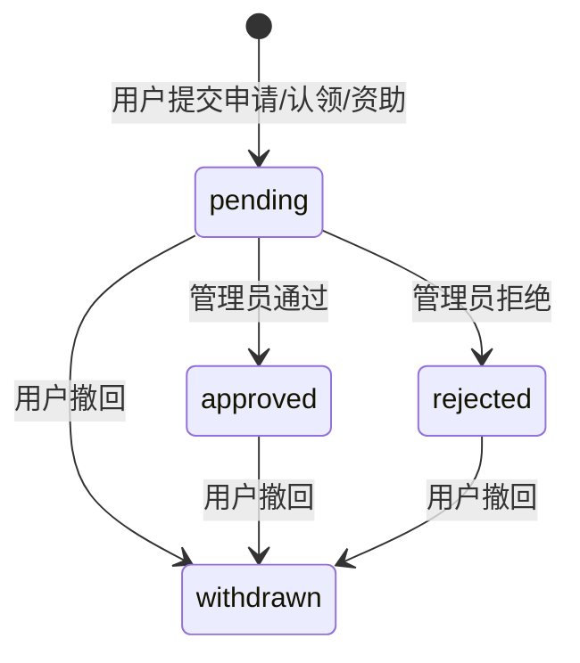

# 课题生命周期重建执行任务文档

> 历史归档说明：本文档记录旧版生命周期重构计划，部分接口语义已被当前产品基准替换。当前有效规则以根目录 `AGENTS.md` 为准：管理员归档通过 `PATCH /api/admin/projects/{id}/` 设置 `stage=archived,is_public=false`，不需要确认；`DELETE /api/admin/projects/{id}/` 为物理删除，前端必须弹确认。

生成日期：2026-06-10

本文基于 [课题生命周期产品设计文档](./project-lifecycle-product-design.md)、当前 Django 模型、Django Ninja API 和 Vue 前端实现，定义本轮课题生命周期重建的执行任务、API 规范和严格验收标准。

本文只设计“如何按现有系统落地”，不引入新的复杂流程，不新增非必要 API，不删除需要保留的历史接口。

## 1. 目标边界

本轮目标是把课题生命周期固定为稳定、可审核、可解释的协作流程：

1. 课题状态只保留：草稿、开放招募、组队中、进行中、暂停、归档。
2. 课题只允许管理员创建、导入、编辑、发布、暂停、归档。
3. 用户只围绕课题进行收藏、申请参与、认领意向、资助意向、提交任务结果。
4. 用户提交的申请、认领、资助意向进入 `pending`，由管理员审核为 `approved` 或 `rejected`，用户可撤回为 `withdrawn`。
5. 任一申请、认领或资助意向审核通过后，如果课题处于开放招募，则自动进入组队中。
6. 是否进入进行中，只由管理员操作决定。
7. 移除“管理员拆任务、任务分配 UID、任务积分奖励”作为当前产品主流程。
8. 保留现有任务和积分接口，避免破坏已有 API、测试和历史数据。

## 2. 当前系统依据

### 2.1 当前模型

| 模型 | 当前位置 | 当前能力 | 本轮处理 |
| --- | --- | --- | --- |
| `Project` | `projects/models.py` | 课题主体、主题、阶段、公开状态、结构化字段、来源文档 | 保留并收敛阶段 |
| `ProjectStage` | `projects/models.py` | 当前含 10 个阶段 | 收敛为 6 个目标阶段 |
| `Theme` | `projects/models.py` | 主题 | 保留 |
| `ThemeFile` | `projects/models.py` | 主题文件域 | 保留 |
| `ProjectDocument` | `projects/models.py` | 课题文档索引 | 保留 |
| `ProjectFollow` | `interactions/models.py` | 收藏 | 保留为用户关系 |
| `ProjectInterest` | `interactions/models.py` | 申请参与 | 保留 |
| `ProjectClaimIntent` | `interactions/models.py` | 认领意向 | 保留 |
| `SponsorIntent` | `interactions/models.py` | 资助意向 | 保留 |
| `Contribution` | `credits/models.py` | 用户贡献提交与审核 | 产品改名为任务结果提交 |
| `ProjectTask` | `projects/models.py` | 任务拆分、分配、进度 | 保留接口，前端产品流程隐藏 |
| `CreditLedger` | `credits/models.py` | 积分流水与任务奖励 | 保留接口，前端产品流程隐藏任务奖励 |
| `AuditLog` | `projects/models.py` | 审计 | 保留并补齐关键动作 |

### 2.2 当前 API

本轮应优先复用以下现有 API：

| 能力 | 现有 API | 本轮使用方式 |
| --- | --- | --- |
| 公开课题列表 | `GET /api/projects/` | 只展示可公开且未归档课题 |
| 公开课题详情 | `GET /api/projects/{id}/` | 展示课题详情、用户状态、任务结果提交入口 |
| 公开主题文件空间 | `GET /api/themes/{slug}/space/` | 只返回可公开且未归档课题 |
| 课题状态卡 | `GET /api/projects/{id}/status-card/` | 课题卡片悬浮状态，使用 UID 分组展示 |
| 收藏 | `POST /api/projects/{id}/follow/` | 保留 |
| 取消收藏 | `POST/DELETE /api/projects/{id}/unfollow/` | 保留 |
| 评分 | `POST /api/projects/{id}/score/` | 既有非生命周期能力，保留接口，前端主流程不新增入口，不影响课题阶段 |
| 申请参与 | `POST /api/projects/{id}/interest/` | 保留，限制课题阶段 |
| 认领意向 | `POST /api/projects/{id}/claim/` | 保留，限制课题阶段 |
| 资助意向 | `POST /api/projects/{id}/sponsor/` | 保留，限制课题阶段 |
| 用户空间 | `GET /api/me/dashboard/` | 保留，前端隐藏任务和积分主流程 |
| 用户撤回意向 | `PATCH /api/me/interactions/{type}/{id}/withdraw/` | 保留 |
| 用户提交任务结果 | `POST /api/me/contributions/` | 保留，`task_id` 继续可选 |
| 用户任务结果列表 | `GET /api/me/contributions/` | 保留 |
| 管理总览 | `GET /api/admin/overview/` | 保留，文案和统计口径调整 |
| 管理员课题列表 | `GET /api/admin/projects/` | 保留 |
| 管理员创建课题 | `POST /api/admin/projects/` | 保留，强制创建为草稿且不公开 |
| 管理员编辑课题 | `PATCH /api/admin/projects/{id}/` | 保留，用于发布、暂停、进入进行中和字段编辑 |
| 管理员归档课题 | `PATCH /api/admin/projects/{id}/` | 当前有效语义：设置 `stage=archived,is_public=false`；历史 `DELETE` 归档口径已失效 |
| 管理员协作审核 | `GET /api/admin/interactions/` | 保留，列表聚合申请/认领/资助 |
| 管理员审核意向 | `PATCH /api/admin/interactions/{type}/{id}/status/` | 保留，限制状态并补课题阶段联动 |
| 管理员任务结果审核 | `GET /api/admin/contributions/` | 保留，产品文案改为任务结果审核 |
| 管理员审核任务结果 | `PATCH /api/admin/contributions/{id}/review/` | 保留，不展示任务积分奖励 |
| 管理主题 | `GET/POST/PATCH/DELETE /api/admin/themes/` | 保留 |
| 管理主题文件域 | `GET/POST/PATCH/DELETE /api/admin/theme-files/` | 保留 |
| 任务接口 | `/api/admin/tasks/`、`/api/me/tasks/` | 保留，不作为当前产品入口 |
| 积分接口 | `/api/admin/credits/`、`/api/me/credits/` | 保留，不作为任务结果审核入口 |

## 3. API 规范化原则

### 3.1 不新增 API

本轮不新增以下 API：

- 不新增单独的“发布课题”接口，使用 `PATCH /api/admin/projects/{id}/` 设置 `stage` 和 `is_public`。
- 不新增单独的“进入组队中”接口，由 `PATCH /api/admin/interactions/{type}/{id}/status/` 审核通过时自动完成。
- 不新增单独的“进入进行中”接口，使用 `PATCH /api/admin/projects/{id}/` 设置 `stage=active`。
- 不新增单独的“组队看板”接口，前端使用 `GET /api/admin/interactions/?status=approved` 按课题聚合。
- 不新增单独的“我的任务结果”接口，继续使用 `GET /api/me/contributions/`。

### 3.2 必要的 API 收敛

| 收敛点 | 当前情况 | 目标 |
| --- | --- | --- |
| 课题阶段枚举 | `ProjectStage` 有 10 个阶段 | 后端、`/api/meta`、`/api/project-schema` 和前端只暴露 6 个 |
| 旧课题阶段 | 可能存在 `experimenting/writing/submitted/published` | 数据迁移到 `active` 或 `archived` |
| 意向状态 | `InteractionStatus` 当前含 `recorded` | 历史 `recorded` 迁移为 `approved`；新数据不允许 `recorded` |
| 审核状态入口 | 当前管理员接口可传任意 `InteractionStatus.values` | 管理员审核只允许 `approved`、`rejected` |
| 用户撤回 | 已有撤回接口 | 保留，只有本人可撤回 |
| 任务结果审核 | 当前可 `needs_revision` 和 `grant_reward` | 新审核只允许 `approved/rejected`；前端不展示奖励；后端接口保留字段，默认不奖励 |
| 公开课题 | 当前以 `is_public=True` 为主 | 草稿和归档不得出现在公开课题库 |

### 3.3 统一错误语义

所有生命周期限制使用现有错误格式，不新增错误结构：

```json
{
  "ok": false,
  "error": {
    "code": "validation_error",
    "message": "..."
  }
}
```

推荐错误文案：

| 场景 | code | message |
| --- | --- | --- |
| 用户对草稿/归档课题操作 | `not_found` 或 `validation_error` | `Project is not available.` |
| 非招募阶段提交申请/认领/资助 | `validation_error` | `Project is not recruiting.` |
| 非进行中课题提交任务结果 | `validation_error` | `Project is not active.` |
| 管理员传入非法意向状态 | `validation_error` | `Invalid interaction status.` |
| 管理员传入非法课题阶段 | `validation_error` | `Invalid project stage.` |

## 4. 生命周期规则

### 4.1 课题阶段

| 阶段 | 值 | 用户可见 | 允许用户收藏 | 允许申请/认领/资助 | 允许提交任务结果 |
| --- | --- | --- | --- | --- | --- |
| 草稿 | `draft` | 否 | 否 | 否 | 否 |
| 开放招募 | `open_recruiting` | 是 | 是 | 是 | 否 |
| 组队中 | `team_building` | 是 | 是 | 是 | 否 |
| 进行中 | `active` | 是 | 是 | 否 | 是 |
| 暂停 | `paused` | 是，公开只读展示 | 否 | 否 | 否 |
| 归档 | `archived` | 否或只读 | 否 | 否 | 否 |

产品判断：

- 收藏是用户关系，不是课题阶段。
- 申请、认领、资助审核通过后，代表课题已出现有效协作关系，因此开放招募自动进入组队中。
- 组队中是否进入进行中，由管理员基于团队完整性和课题准备度判断。
- 任务结果通过或拒绝不自动改变课题阶段。

### 4.2 意向状态

| 状态 | 值 | 创建方 | 说明 |
| --- | --- | --- | --- |
| 待审核 | `pending` | 用户提交后自动生成 | 管理员未处理 |
| 已通过 | `approved` | 管理员 | 成为有效协作关系 |
| 已拒绝 | `rejected` | 管理员 | 不纳入组队关系 |
| 已撤回 | `withdrawn` | 用户 | 用户主动撤回 |

状态流转：



### 4.3 任务结果状态

| 状态 | 值 | 说明 |
| --- | --- | --- |
| 待审核 | `submitted` | 用户提交任务结果 |
| 已通过 | `approved` | 管理员审核通过 |
| 已拒绝 | `rejected` | 管理员审核拒绝 |

当前 `ContributionStatus.NEEDS_REVISION` 可作为历史兼容保留，但本轮前端不展示“退回修改”入口，管理员新审核不得写入 `needs_revision`。

## 5. 执行任务

### 任务 1：收敛课题阶段枚举与迁移

目标：

- 后端只暴露 6 个课题阶段。
- 历史阶段被明确迁移，不让前端或 API 文档继续出现写作中、投稿中、已发表、实验中。

涉及文件：

- `projects/models.py`
- `projects/importing.py`
- `projects/migrations/`
- `api/ninja_api.py`
- `api/tests.py`
- `frontend/src/main.js`
- `frontend/src/projectMarkdown.js`
- `frontend/src/projectMarkdown.test.js`
- `frontend/src/uiPlacement.test.js`

执行要求：

1. `ProjectStage` 只保留 `draft/open_recruiting/team_building/active/paused/archived`。
2. 新增数据迁移，把旧阶段按以下规则转换：
   - `experimenting -> active`
   - `writing -> active`
   - `submitted -> active`
   - `published -> archived`
3. `projects/importing.py` 中中文阶段映射只输出 6 个目标阶段；旧中文阶段作为兼容输入时映射到目标阶段。
4. `/api/meta`、`/api/project-schema` 的阶段选项只出现 6 个目标阶段。
5. 前端课题筛选、管理员课题表单、Markdown 导入预览只出现 6 个目标阶段。

验收标准：

- `GET /api/meta` 返回的 `project_stages` 只有 6 项。
- `GET /api/project-schema` 返回的 `stage_values` 只有 6 项。
- 前端任何课题状态下拉不出现“实验中、写作中、投稿中、已发表”。
- 数据库中旧阶段数据迁移后不再保留旧值。
- `conda run -n openmedailab python manage.py test` 通过。

### 任务 2：规范课题创建、发布、暂停、归档

目标：

- 管理员创建或 Markdown 导入课题后一定是草稿。
- 发布、进入进行中、暂停、归档都复用现有管理员课题更新接口。

涉及文件：

- `api/ninja_api.py`
- `projects/importing.py`
- `frontend/src/main.js`
- `api/tests.py`

执行要求：

1. `POST /api/admin/projects/` 继续强制 `stage=draft`、`is_public=false`。
2. Markdown 导入到前端预览和提交时继续强制为草稿，不直接公开。
3. 管理员发布草稿时，前端调用 `PATCH /api/admin/projects/{id}/`，写入 `stage=open_recruiting`、`is_public=true`。
4. 管理员进入进行中时，前端调用同一 `PATCH`，写入 `stage=active`。
5. 管理员暂停时，前端调用同一 `PATCH`，写入 `stage=paused`。
6. 管理员归档时，调用 `PATCH /api/admin/projects/{id}/`，后端设置 `stage=archived`、`is_public=false`；历史 `DELETE` 归档口径已失效。
7. 公开课题列表和公开课题详情不得展示草稿和归档课题。
8. 公开主题文件空间 `GET /api/themes/{slug}/space/` 中的关联课题同样不得展示草稿和归档课题。
9. 公开接口只展示 `open_recruiting/team_building/active/paused` 中 `is_public=true` 的课题。

验收标准：

- 管理员新建课题后，API 响应和数据库均为 `draft` 且 `is_public=false`。
- 点击发布后，公开课题库能看到该课题，阶段为开放招募。
- 点击进入进行中后，该课题阶段为 `active`。
- 点击暂停后，该课题阶段为 `paused`，用户不能提交新申请和任务结果。
- 点击归档后，该课题不再出现在公开课题库。
- 点击归档后，该课题不再出现在主题文件空间的关联课题列表。
- 不新增发布、暂停、归档专用 API。

### 任务 3：规范用户申请、认领、资助生命周期

目标：

- 用户申请、认领、资助只在开放招募和组队中可提交。
- 管理员审核通过后，开放招募课题自动进入组队中。
- 意向状态不再暴露 `recorded`。

涉及文件：

- `interactions/models.py`
- `projects/models.py`
- `projects/migrations/`
- `api/ninja_api.py`
- `api/serializers.py`
- `api/tests.py`
- `frontend/src/main.js`
- `frontend/src/uiPlacement.test.js`

执行要求：

1. 用户通过现有 `interest/claim/sponsor` 接口提交时，后端校验课题必须是 `open_recruiting` 或 `team_building`。
2. 提交成功后状态为 `pending`。
3. 管理员审核接口只接受 `approved` 或 `rejected`。
4. 如果管理员将任一申请、认领、资助审核为 `approved`，且课题当前是 `open_recruiting`，后端在同一事务中把课题改为 `team_building`。
5. 如果课题已是 `team_building`、`active`、`paused` 或 `archived`，审核通过不自动覆盖课题阶段。
6. 用户撤回继续使用现有撤回接口，撤回不自动回退课题阶段。
7. 前端不展示“记录”按钮，不展示 `recorded` 筛选。
8. 历史 `recorded` 数据迁移为 `approved`；如迁移前仍被读取，前端只按已通过兼容展示，后端新写入不再产生 `recorded`。
9. `Project.team_status` 只统计 `approved` 的参与意向和资助意向，不再把 `pending/rejected/withdrawn` 算进基础团队。

验收标准：

- 开放招募课题中，用户提交申请/认领/资助成功后为 `pending`。
- 管理员通过任一意向后，原开放招募课题自动变为 `team_building`。
- 管理员拒绝意向时，课题阶段不变。
- 管理员审核接口传 `recorded` 返回 422。
- 待审核和已拒绝的申请不会让 `team_status.roles` 计数增加。
- 前端协作管理只展示通过和拒绝操作。
- 用户撤回后状态为 `withdrawn`，课题阶段不自动回退。

### 任务 4：协作管理替代任务分配

目标：

- 管理员空间把“协作审核”升级为“协作管理”。
- 协作管理包含待审核意向和组队看板。
- 不再提供“拆任务”和“分配 UID”作为主流程。

涉及文件：

- `frontend/src/main.js`
- `frontend/src/styles.css`
- `frontend/src/api.js`
- `frontend/src/api.test.js`
- `frontend/src/uiPlacement.test.js`

执行要求：

1. 管理员导航中保留“管理”，管理员页签中使用“协作管理”。
2. 协作管理第一块展示待审核意向，数据来自 `GET /api/admin/interactions/?status=pending`。
3. 协作管理第二块展示组队看板，数据来自 `GET /api/admin/interactions/?status=approved` 后按课题聚合。
4. 组队看板必须按分页拉取所有 approved 数据，直到响应中的 `pagination.has_next=false`，不得只读第一页。
5. 组队看板每个课题展示：
   - 课题 ID。
   - 课题标题。
   - 当前课题阶段。
   - 已通过参与 UID 和身份。
   - 已通过认领 UID 和类型。
   - 已通过资助 UID 和类型。
   - 操作：进入进行中、暂停、归档。
6. 所有涉及人员的地方只展示 UID，不展示用户名、邮箱、真实姓名。
7. 从主导航和管理员主页面移除“任务管理”作为独立主流程入口。
8. `api.js` 中可保留任务 API 包装函数，但前端页面不主动使用它们创建或分配任务。

验收标准：

- 管理员进入管理页，能看到“协作管理”。
- 待审核意向可通过/拒绝。
- 通过后，该意向出现在组队看板。
- 当 approved 意向超过一页时，组队看板仍展示全部分页数据。
- 组队看板不展示用户名、邮箱、真实姓名。
- 点击进入进行中后，使用 `PATCH /api/admin/projects/{id}/` 完成，未新增 API。
- 页面中没有“创建任务”“分配 UID”“任务奖励”的主流程按钮。

### 任务 5：任务结果提交与审核改名收敛

目标：

- 产品上不再使用“贡献审核”作为主文案，统一为“任务结果”。
- 用户可在进行中课题提交任务结果。
- 管理员审核任务结果，但不发放任务积分。

涉及文件：

- `api/ninja_api.py`
- `api/serializers.py`
- `api/tests.py`
- `frontend/src/main.js`
- `frontend/src/api.js`
- `frontend/src/uiPlacement.test.js`

执行要求：

1. 用户提交任务结果继续使用 `POST /api/me/contributions/`。
2. `task_id` 继续可选，前端不要求用户选择任务。
3. 后端校验课题必须是 `active` 且 `is_public=true`。
4. 用户空间文案改为“我的任务结果”。
5. 管理员页签文案改为“任务结果审核”。
6. 管理员审核继续使用 `PATCH /api/admin/contributions/{id}/review/`。
7. 前端不展示 `grant_reward`、任务奖励、积分奖励按钮。
8. 后端保留 `grant_reward` 字段，避免破坏 API，但前端提交时固定不传或传 `false`。
9. 管理员新审核只允许 `approved` 或 `rejected`；传 `needs_revision` 返回 422。

验收标准：

- 非进行中课题提交任务结果返回 422。
- 进行中课题可提交任务结果，状态为 `submitted`。
- 管理员可审核为 `approved` 或 `rejected`。
- 管理员审核接口传 `needs_revision` 返回 422。
- 审核通过不会自动产生 `task_reward` 积分流水，除非外部系统显式调用旧接口并传 `grant_reward=true`。
- 前端不出现“通过并奖励”“任务积分”“任务奖励”入口。

### 任务 6：用户空间收敛

目标：

- 用户空间只展示收藏、申请/认领/资助、任务结果。
- 不展示被分配任务、任务积分作为核心功能。

涉及文件：

- `frontend/src/main.js`
- `frontend/src/styles.css`
- `frontend/src/uiPlacement.test.js`

执行要求：

1. 用户空间总览展示：
   - 我的收藏。
   - 我的申请/认领/资助。
   - 已通过协作关系。
   - 我的任务结果。
2. 我的收藏继续来自 `GET /api/me/dashboard/` 中的 `follows`。
3. 我的协作关系继续来自 `interests/claims/sponsors`。
4. 我的任务结果继续来自 `contributions` 或 `GET /api/me/contributions/`。
5. 隐藏“我的任务”“任务积分”“积分流水”作为主入口。
6. 用户可撤回未完成或已完成审核关系，调用现有撤回接口。

验收标准：

- 普通用户登录后，看不到“我的任务”主入口。
- 普通用户能看到收藏课题列表。
- 普通用户能看到申请、认领、资助的状态。
- 普通用户能看到任务结果审核状态和审核意见。
- 撤回意向后状态变为 `withdrawn`。

### 任务 7：课题卡片和详情页状态统一

目标：

- 课题卡片、悬浮小卡片、详情页全部使用同一套生命周期语言。
- 收藏是“我的关系”，不写成课题状态。

涉及文件：

- `api/ninja_api.py`
- `api/serializers.py`
- `frontend/src/main.js`
- `frontend/src/styles.css`
- `frontend/src/uiPlacement.test.js`

执行要求：

1. 课题卡片展示课题阶段：开放招募、组队中、进行中、暂停。
2. 悬浮小卡片第一行只展示课题阶段。
3. “我的状态”只展示当前用户对该课题的收藏、申请、认领、资助状态。
4. “课题状态”按关系分组展示 UID：
   - 收藏：UID 列表。
   - 参与：按身份和审核状态展示 UID。
   - 认领：按类型和审核状态展示 UID。
   - 资助：按类型和审核状态展示 UID。
5. 不展示“相关 UID N 个”这类泛化文案。
6. 如果 UID 多，卡片内部滚动，不撑破课题卡片。
7. 手机端悬浮卡片不得遮挡课题标题的主要阅读区域。
8. 当前 `status-card` API 可继续使用；若后端保留任务和贡献 UID 分组，前端本轮不展示它们。

验收标准：

- 收藏用户的 UID 出现在“收藏”分组。
- 参与申请通过用户的 UID 出现在对应“参与：身份（已通过）”分组。
- 当前用户自己的 UID 在对应分组中高亮。
- 10 个以上 UID 时，卡片内部可滚动。
- 小屏幕下卡片不遮挡标题首行，不造成页面横向溢出。

### 任务 8：评分接口边界固定

目标：

- 当前系统存在评分模型和接口，但评分不属于本轮课题生命周期。
- 评分不得影响课题阶段、组队状态或用户协作关系。

涉及文件：

- `interactions/models.py`
- `api/ninja_api.py`
- `api/serializers.py`
- `frontend/src/api.js`
- `frontend/src/main.js`
- `frontend/src/uiPlacement.test.js`

执行要求：

1. 保留 `ProjectScore` 和 `POST /api/projects/{id}/score/`，不删除已有接口。
2. 前端不新增评分主入口；如现有详情页仍保留评分，应明确标注为“评价记录”，不放入生命周期状态卡。
3. 评分提交不得改变 `Project.stage`。
4. 评分提交不得进入协作管理和组队看板。
5. `status-card` 中不按评分展示 UID。

验收标准：

- 提交评分后，课题阶段不变化。
- 协作管理的待审核意向不出现评分记录。
- 组队看板不出现评分 UID。
- 状态悬浮卡不出现评分分组。

### 任务 9：审计与 API 文档同步

目标：

- 管理员关键动作都有审计。
- `/api/docs` 中对外展示的生命周期接口清晰、无冗余新接口。

涉及文件：

- `api/serializers.py`
- `api/ninja_api.py`
- `api/tests.py`
- `frontend/src/api.test.js`
- `docs/project-lifecycle-product-design.md`
- `docs/project-lifecycle-implementation-task-plan.md`

执行要求：

1. 审计标签把“贡献”改为“任务结果”。
2. 审计标签把“任务创建/分配/奖励”保留为历史接口文案，不在产品主流程突出。
3. 管理员审核意向时，审计记录审核前后状态和 review_note。
4. 开放招募自动进入组队中时，审计记录课题阶段变化。
5. `/api/docs` 中不得出现新增的生命周期专用冗余 API。
6. API 包装层 `frontend/src/api.js` 不新增重复函数，例如 `publishProject`、`pauseProject`、`startProject`，统一调用 `adminUpdateProject`。

验收标准：

- 审计日志能看到意向审核、课题阶段变化、任务结果审核。
- `/api/docs` 路径集合没有新增生命周期专用接口。
- 前端 API 包装层没有重复包装同一个后端能力。
- 文档、API 文案和前端页面用词一致。
- 自动化测试至少断言以下审计 action：`interaction.review`、`project.stage_auto_team_building`、`contribution.review`。
- `frontend/src/api.test.js` 至少断言没有 `publishProject/startProject/pauseProject/archiveProject` 等重复包装函数。

## 6. 禁止事项

本轮不得做以下事情：

1. 不新增“发布课题”“暂停课题”“进入进行中”等专用 API。
2. 不新增“组队看板”专用 API，先用现有 `admin/interactions` 聚合。
3. 不新增任务分配、任务拆解、任务奖励的新 UI。
4. 不删除 `/api/admin/tasks/`、`/api/me/tasks/`、`/api/admin/credits/`、`/api/me/credits/`。
5. 不把收藏作为课题状态。
6. 不把任务结果审核通过自动变更课题阶段。
7. 不展示用户名、邮箱、真实姓名作为协作关系人员标识。
8. 不新增手写 JSON 作为普通管理员表单输入方式。

## 7. 严格验收清单

### 7.1 后端验收

- `ProjectStage.choices` 只包含 6 个目标阶段。
- `/api/meta` 和 `/api/project-schema` 只返回 6 个目标阶段。
- 旧阶段数据迁移规则明确且测试覆盖。
- 历史 `recorded` 意向迁移为 `approved` 或新写入被 422 拦截。
- `POST /api/admin/projects/` 创建结果永远是草稿且不公开。
- 历史旧口径：`DELETE /api/admin/projects/{id}/` 曾表示归档；当前已失效，现为物理删除。
- `/api/projects/`、`/api/projects/{id}/`、`/api/themes/{slug}/space/` 都不会暴露草稿和归档课题。
- 用户只能在开放招募或组队中提交申请/认领/资助。
- 用户只能在开放招募、组队中或进行中收藏课题；暂停和归档不允许新收藏。
- 管理员审核意向只允许 `approved/rejected`。
- 开放招募课题任一意向审核通过后自动进入组队中。
- `Project.team_status` 只统计已通过关系。
- 用户只能对进行中课题提交任务结果。
- 管理员新审核任务结果只允许 `approved/rejected`。
- 任务结果审核不默认发放积分。
- 所有关键动作写入 `AuditLog`。

### 7.2 前端验收

- 公开课题库不出现草稿和归档课题。
- 课题状态筛选只出现 6 个目标阶段。
- 管理员课题表单只出现 6 个目标阶段。
- 管理员页面中“协作管理”包含待审核意向和组队看板。
- 页面中没有“创建任务”“分配 UID”“通过并奖励”的主流程入口。
- 用户空间展示收藏、协作关系、任务结果，不展示任务分配主流程。
- 悬浮状态卡可滚动、可高亮当前用户 UID、小屏不遮挡主标题。
- 所有涉及人员的协作列表只展示 UID。

### 7.3 自动化测试

必须通过：

```bash
conda run -n openmedailab python manage.py test
node --test frontend/src/*.test.js
node --check frontend/src/main.js
```

建议新增或更新测试：

- 后端：课题阶段枚举和旧阶段迁移。
- 后端：意向审核通过后自动进入组队中。
- 后端：非招募阶段不能申请/认领/资助。
- 后端：非进行中阶段不能提交任务结果。
- 后端：管理员审核意向传 `recorded` 返回 422。
- 前端：协作管理不展示任务创建和分配入口。
- 前端：组队看板分页拉全 approved 意向。
- 前端：任务结果审核不展示奖励入口。
- 前端：状态悬浮卡 UID 分组和滚动规则。
- 前端：API 包装层不新增生命周期重复函数。

### 7.4 浏览器验收

至少使用本地浏览器验证以下路径：

1. 访客打开课题库，只看到开放招募、组队中、进行中或暂停的公开课题。
2. 普通用户收藏课题，课题状态不变化，用户空间收藏增加。
3. 普通用户无法收藏暂停和归档课题。
4. 普通用户申请参与开放招募课题，状态为待审核。
5. 管理员通过该申请，课题自动进入组队中。
6. 管理员在组队看板点击进入进行中，课题状态变为进行中。
7. 普通用户无法在进行中课题继续提交新申请。
8. 普通用户在进行中课题提交任务结果。
9. 管理员审核任务结果，通过或拒绝后用户空间能看到结果。
10. 管理员归档课题后，公开课题库和主题文件空间均不可见。

## 8. 交付判断

本轮达到交付要求的判断标准：

- 课题生命周期状态已经统一为 6 个。
- 用户关系、管理员审核、课题阶段推进三者边界清晰。
- 所有必要能力均复用现有 API。
- 没有新增复杂冗余接口。
- 任务拆分、UID 分配、任务积分奖励不再作为当前产品主流程出现。
- 任务结果提交和审核可独立闭环。
- 文档、API、前端页面和自动化测试口径一致。
