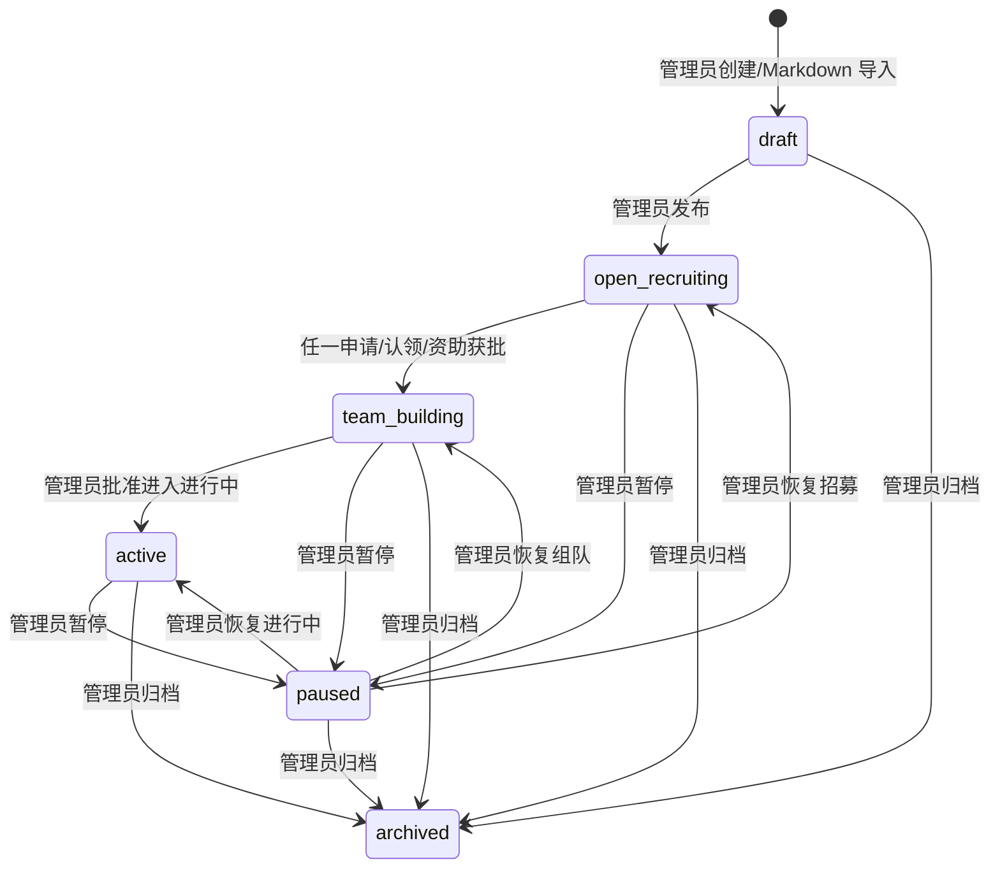
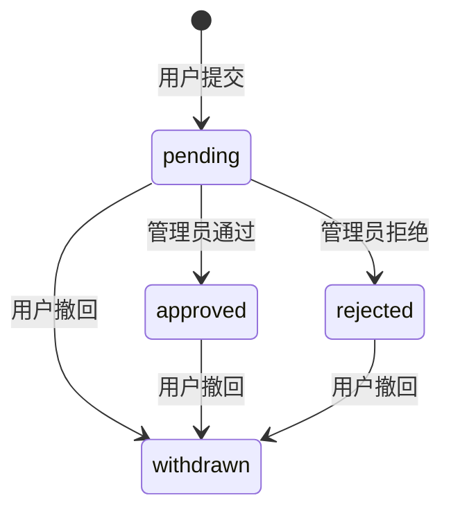
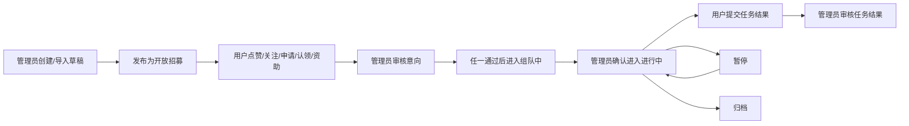

# 课题生命周期产品设计文档

生成日期：2026-06-10

本文从资深产品经理视角，基于当前代码仓库已有模型、API 和前端页面，重新固定 OpenMedAILab 的课题生命周期。本文是后续实现和验收的产品依据；如旧文档仍包含“写作中、投稿中、已发表、任务拆分、任务分配、任务积分、收藏课题”等旧口径，以本文为准。

2026-06-11 产品术语决策：课题卡片只保留“点赞”和“关注”两个轻量交互，不再单独设置“收藏”。“点赞”表示认可；“关注”表示持续跟进、进入我的关注列表、作为排序热度信号。现有后端 `ProjectFollow` 模型和 follow/unfollow API 暂时继续复用，但面向用户的前端文案统一展示为“关注/取消关注”，不展示“收藏”。

## 1. 设计目标

课题生命周期只解决三件事：

1. 管理员如何创建、发布、推进和归档课题。
2. 用户如何围绕课题表达关系和提交结果。
3. 管理员如何审核用户关系和任务结果。

本轮不再把课题拆成任务，也不再把任务分配给 UID。任务积分暂不做产品功能，只保留当前后端接口和数据结构，避免破坏已有代码。

## 2. 当前系统基础

### 2.1 已有模型

当前代码已经具备以下基础模型：

| 模型 | 文件 | 当前作用 | 本设计处理 |
| --- | --- | --- | --- |
| `Project` | `projects/models.py` | 课题主体，含主题、阶段、公开状态、结构化字段、来源文档 | 继续作为课题唯一主体 |
| `Theme` | `projects/models.py` | 主题 | 保留 |
| `ThemeFile` | `projects/models.py` | 主题文件域 | 保留 |
| `ProjectDocument` | `projects/models.py` | 课题 Markdown/PDF/HTML 文档索引 | 保留 |
| `ProjectFollow` | `interactions/models.py` | 用户关注课题 | 只作为用户关系，不作为课题状态；后端模型名暂不改，前端文案统一为“关注” |
| `ProjectInterest` | `interactions/models.py` | 用户申请参与，并选择参与身份 | 保留 |
| `ProjectClaimIntent` | `interactions/models.py` | 用户认领某类工作 | 保留为“认领意向” |
| `SponsorIntent` | `interactions/models.py` | 用户提交资助意向 | 保留 |
| `Contribution` | `credits/models.py` | 当前叫贡献，支持提交和审核 | 产品上改名为“任务结果提交” |
| `ProjectTask` | `projects/models.py` | 当前支持任务拆分、分配 UID、状态流转 | 本轮从产品流程移除，接口保留 |
| `CreditLedger` | `credits/models.py` | 当前支持任务奖励和积分流水 | 本轮不做任务积分，接口保留 |
| `AuditLog` | `projects/models.py` | 管理动作审计 | 保留 |

### 2.2 已有接口

当前接口已经覆盖大多数必要能力：

| 能力 | 当前接口 | 本设计处理 |
| --- | --- | --- |
| 管理员课题列表 | `GET /api/admin/projects/` | 保留 |
| 管理员课题详情 | `GET /api/admin/projects/{id}/` | 保留 |
| 管理员创建课题 | `POST /api/admin/projects/` | 保留，默认草稿 |
| 管理员编辑课题 | `PATCH /api/admin/projects/{id}/` | 保留 |
| 管理员归档课题 | `DELETE /api/admin/projects/{id}/` | 保留，产品语义为归档 |
| 主题管理 | `GET/POST/PATCH/DELETE /api/admin/themes/` | 保留 |
| 主题文件域管理 | `GET/POST/PATCH/DELETE /api/admin/theme-files/` | 保留 |
| 用户关注/取消关注 | `/api/projects/{id}/follow/` 和 `/unfollow/` | 保留，前端文案不使用“收藏” |
| 用户申请参与 | `POST /api/projects/{id}/interest/` | 保留 |
| 用户认领意向 | `POST /api/projects/{id}/claim/` | 保留 |
| 用户资助意向 | `POST /api/projects/{id}/sponsor/` | 保留 |
| 管理员审核意向 | `PATCH /api/admin/interactions/{type}/{id}/` | 保留，但产品状态精简 |
| 用户撤回意向 | `PATCH /api/me/interactions/{type}/{id}/withdraw/` | 保留 |
| 用户提交结果 | `POST /api/me/contributions/` | 保留，产品改名为任务结果提交 |
| 管理员审核结果 | `PATCH /api/admin/contributions/{id}/review/` | 保留，产品改名为任务结果审核 |
| 任务接口 | `/api/admin/tasks/`、`/api/me/tasks/` | 保留接口，不作为本轮页面能力 |
| 积分接口 | `/api/admin/credits/`、`/api/me/credits/` | 保留接口，不作为任务结果审核动作 |

## 3. 课题状态

### 3.1 目标状态

课题状态只保留以下 6 个：

| 状态值 | 中文 | 是否用户可见 | 含义 |
| --- | --- | --- | --- |
| `draft` | 草稿 | 否 | 管理员创建或导入后尚未发布 |
| `open_recruiting` | 开放招募 | 是 | 课题公开，允许用户关注、申请参与、认领、资助 |
| `team_building` | 组队中 | 是 | 已有至少一个申请/认领/资助被管理员通过，正在形成协作团队 |
| `active` | 进行中 | 是 | 管理员确认课题进入执行状态 |
| `paused` | 暂停 | 视情况 | 管理员暂时停止课题推进，可继续保留历史关系 |
| `archived` | 归档 | 否或只读 | 课题关闭，不再参与招募和提交 |

### 3.2 当前代码偏差

当前 `ProjectStage` 还包含 `experimenting`、`writing`、`submitted`、`published`。目标实现时必须移除或隐藏这些状态，避免用户和管理员看到超过 6 个生命周期状态。

推荐迁移策略：

| 当前状态 | 目标状态 |
| --- | --- |
| `draft` | `draft` |
| `open_recruiting` | `open_recruiting` |
| `team_building` | `team_building` |
| `active` | `active` |
| `experimenting` | `active` |
| `writing` | `active` |
| `submitted` | `active` |
| `published` | `archived` |
| `paused` | `paused` |
| `archived` | `archived` |

## 4. 课题状态流转

### 4.1 草稿

进入条件：

- 管理员系统内创建课题。
- 管理员 Markdown 导入课题。

产品规则：

- 草稿课题不进入用户课题库。
- 草稿允许编辑、补字段、确认主题和主题文件域。
- 草稿允许归档。
- 草稿发布后进入 `open_recruiting`。

### 4.2 开放招募

进入条件：

- 管理员发布草稿课题。

产品规则：

- 用户可以关注/取消关注。
- 用户可以申请参与，并选择身份。
- 用户可以提交认领意向。
- 用户可以提交资助意向。
- 管理员可以审核这些意向。

### 4.3 组队中

进入条件：

- 任一用户申请参与、认领意向或资助意向被管理员审核为 `approved`。

产品规则：

- 只要有任何一个用户关系获批，课题即进入 `team_building`。
- 组队中页面重点展示已通过的 UID、身份、认领类型和资助类型。
- 不创建任务，不分配 UID。
- 管理员在协作管理中判断组队是否足够，并决定是否让课题进入 `active`。

### 4.4 进行中

进入条件：

- 管理员确认课题进入进行中。

产品规则：

- 进行中课题仍允许用户关注。
- 进行中课题不再接受新的申请参与、认领意向和资助意向。
- 如需重新招募，管理员应将课题调整回开放招募或组队中，而不是在进行中继续收新意向。
- 用户可以提交任务结果。
- 管理员审核任务结果。
- 任务结果通过不自动改变课题状态。

### 4.5 暂停

进入条件：

- 管理员暂停课题。

产品规则：

- 暂停课题不建议继续接受新申请和新任务结果。
- 已有关注、申请、审核记录继续保留。
- 管理员可以恢复到开放招募、组队中或进行中。

### 4.6 归档

进入条件：

- 管理员归档课题。

产品规则：

- 归档不是物理删除。
- 归档课题默认不在用户课题库展示。
- 归档后不允许新关注、新申请、新认领、新资助、新任务结果。
- 管理员仍可在后台查看历史记录和审计。

## 5. 用户与课题的交互生命周期

用户与课题之间有两类关系：

1. 轻量关系：点赞、关注。
2. 审核关系：申请参与、认领意向、资助意向。

### 5.1 点赞、关注与收藏的产品口径

点赞和关注都是用户关系，不是课题状态。

产品判断：

- 点赞表达“我认可这个课题”，是轻量反馈，不代表持续跟进。
- 关注表达“我想持续跟进这个课题”，进入我的关注列表，可用于课题卡片、排序信号和热度统计。
- 不单独保留“收藏”。对课题对象来说，“收藏”和“关注”都会被用户理解为以后还要再看，功能高度重叠，应合并为“关注”。
- 关注不会触发 `open_recruiting -> team_building`。
- 关注不会触发通知管理员审核。

结论：前端只展示“点赞”和“关注”。现有 `ProjectFollow`、follow/unfollow API 继续作为关注关系的技术实现，后续改后端时再评估是否重命名模型和接口。

### 5.2 申请参与

用户行为：

- 用户在课题详情页提交申请参与。
- 用户必须选择参与身份，即当前 `ParticipationRole`，例如医生、学生、Leader、AI 工程师、医学统计、文献整理、数据处理等。
- 提交后状态为 `pending`。

管理员行为：

- 管理员在协作管理中审核。
- 审核通过为 `approved`。
- 审核拒绝为 `rejected`。

用户后续：

- 用户可撤回为 `withdrawn`。
- 如果已通过后撤回，课题仍保持当前课题阶段，不自动回退。

### 5.3 认领意向

用户行为：

- 用户提交认领意向，例如认领项目负责人、实验、文献整理、数据处理、模型实现、医学审核等。
- 提交后状态为 `pending`。

状态流转：

### 5.4 资助意向

用户行为：

- 用户提交资助意向，例如经费、算力、数据整理预算、标注预算、专家咨询等。
- 提交后状态为 `pending`。

状态流转同申请参与和认领意向。

### 5.5 状态精简要求

当前代码中的 `InteractionStatus` 还包含 `recorded`。目标产品状态只展示：

- `pending`
- `approved`
- `rejected`
- `withdrawn`

处理建议：

- 前端协作审核不再提供“记录”按钮。
- 后端迁移或兼容处理历史 `recorded`，目标语义等同于 `approved`。
- 新数据不得再写入 `recorded`。
- API 文档和产品文案不再把 `recorded` 作为用户生命周期状态。

## 6. 用户提交任务结果

### 6.1 产品命名

当前模型名是 `Contribution`，前端旧文案是“贡献”。本设计中统一改为“任务结果提交”。

原因：

- 用户不再领取由管理员拆分和分配的任务。
- 用户是在课题进行中后，围绕课题提交自己的工作结果。
- “任务结果”比“贡献”更接近审核对象，便于管理员处理。

### 6.2 用户提交

入口：

- 用户空间：我的任务结果。
- 课题详情页：提交任务结果。

字段：

- 课题。
- 标题。
- 说明。
- 文件路径或附件引用。

当前接口：

- 继续复用 `POST /api/me/contributions/`。
- `task_id` 不再作为必填，也不鼓励前端展示。

### 6.3 管理员审核

页面名称：

- 旧“贡献审核”改为“任务结果审核”。

目标状态：

| 状态 | 中文 | 含义 |
| --- | --- | --- |
| `submitted` | 待审核 | 用户已提交，等待管理员审核 |
| `approved` | 已通过 | 管理员认可该结果 |
| `rejected` | 已拒绝 | 管理员拒绝该结果 |

当前代码还支持 `needs_revision`。本轮主流程不展示该状态，管理员新审核不写入 `needs_revision`；历史数据如存在，仅作为兼容状态处理。

### 6.4 不做任务积分

当前后端支持 `CreditLedger` 和任务奖励发放，但本轮不做任务积分。

产品要求：

- 任务结果审核时不展示“通过并奖励”。
- 不展示任务奖励积分字段。
- 不因任务结果通过自动发放积分。
- 相关积分接口保留，不删除。

## 7. 管理员与课题的交互

管理员有 4 类主要职责。

### 7.1 管理主题与主题文件域

保留现有能力：

- 创建、编辑、停用主题。
- 创建、编辑、停用主题文件域。
- 主题文件域用于课题详情和文件空间展示。

### 7.2 导入、创建、编辑、归档课题

保留现有能力：

- 系统内创建课题。
- Markdown 文件/文件夹导入课题。
- 编辑课题。
- 归档课题。

产品调整：

- 课题状态选择只展示 6 个目标状态。
- 课题管理页不展示写作中、投稿中、已发表等状态。
- 归档是关闭课题，不是删除课题。

### 7.3 审核用户参与、认领、资助意向

保留现有协作审核能力，但精简动作：

- 通过。
- 拒绝。

移除产品动作：

- 记录。

审核结果影响课题状态：

- 任一申请参与/认领/资助被通过后，如果课题当前是 `open_recruiting`，自动进入 `team_building`。
- 如果课题已是 `team_building`、`active`、`paused` 或 `archived`，不自动覆盖当前课题状态。

### 7.4 审核任务结果

旧“贡献审核”改为“任务结果审核”。

管理员可以：

- 查看待审核任务结果。
- 按课题、用户 UID、状态筛选。
- 通过或拒绝任务结果。
- 填写审核意见。

管理员不做：

- 不发放任务积分。
- 不把结果自动转成课题阶段变化。
- 不把结果自动拆成后续任务。

## 8. 协作管理页面设计

### 8.1 页面结构

管理员空间中的“协作管理”应包含两个区块：

1. 待审核意向。
2. 组队看板。

### 8.2 待审核意向

展示内容：

- 课题标题和课题 ID。
- 用户 UID。
- 类型：申请参与、认领意向、资助意向。
- 身份或子类型。
- 留言。
- 状态。
- 操作：通过、拒绝。

不展示：

- 用户名。
- 邮箱。
- 真实姓名。
- 记录按钮。

### 8.3 组队看板

进入条件：

- 课题存在至少一个 `approved` 的申请参与、认领或资助意向。

展示内容：

- 课题标题、课题 ID、当前课题状态。
- 已通过参与 UID 和身份。
- 已通过认领 UID 和认领类型。
- 已通过资助 UID 和资助类型。
- 管理员操作：批准进入进行中、暂停、归档。

产品意义：

- 这是“组队完成后”的合适展示窗口。
- 它替代原先“审核后任务管理”和“任务分配 UID”。
- 管理员在这里判断团队是否可以开始推进。

## 9. 用户空间设计

用户空间只保留和用户直接相关的关系与结果。

### 9.1 总览

展示：

- 关注课题数。
- 申请/认领/资助意向数。
- 已通过关系数。
- 待审核任务结果数。

不展示：

- 分配任务数。
- 任务积分。

### 9.2 我的关注

展示用户关注的课题。

关注是用户关系，因此只影响这个页面和课题卡片上的“我的状态”，不影响课题阶段。

### 9.3 我的申请

聚合展示：

- 申请参与。
- 认领意向。
- 资助意向。

每条展示：

- 课题。
- 类型。
- 身份或子类型。
- 状态：pending、approved、rejected、withdrawn。
- 操作：撤回。

### 9.4 我的任务结果

由旧“我的贡献”改名而来。

展示：

- 任务结果标题。
- 所属课题。
- 提交说明。
- 文件路径或附件引用。
- 审核状态。
- 审核意见。

不展示：

- 我的任务。
- 任务奖励。
- 任务进度。
- 分配 UID。

## 10. 课题详情页设计

课题详情页展示课题本身和用户关系。

### 10.1 课题本身信息

展示：

- 标题。
- 主题。
- 课题 ID。
- 当前课题状态。
- 摘要。
- 科学问题。
- 研究目标。
- 技术路线。
- 数据需求。
- 评价指标。
- 预期成果。
- 合规说明。
- 主题文件域。
- 课题原始文档。

### 10.2 用户关系信息

展示：

- 是否已关注。
- 我的申请参与状态。
- 我的认领意向状态。
- 我的资助意向状态。

### 10.3 可操作动作

按课题状态控制：

| 课题状态 | 用户可操作 |
| --- | --- |
| 草稿 | 用户不可见 |
| 开放招募 | 点赞、关注、申请参与、认领、资助 |
| 组队中 | 点赞、关注、申请参与、认领、资助、查看组队状态 |
| 进行中 | 点赞、关注、提交任务结果；不允许新申请、认领和资助 |
| 暂停 | 查看历史状态，默认不允许新申请和提交 |
| 归档 | 默认不可见；如管理员查看则只读 |

## 11. 需要从当前产品移除或隐藏的能力

### 11.1 课题状态移除

从产品和接口文档中移除：

- 实验中。
- 写作中。
- 投稿中。
- 已发表。

### 11.2 任务拆分和任务分配移除

从前端产品流程中移除：

- 管理员“任务管理”主 tab。
- 课题列表中的“建任务”按钮。
- 任务创建表单。
- 分配 UID。
- 用户“我的任务”。
- 任务进度。

保留：

- `ProjectTask` 模型。
- `/api/admin/tasks/` 和 `/api/me/tasks/` 接口。

保留原因：

- 当前代码已有接口和测试依赖。
- 后续如果重新启用任务管理，可以作为二期能力。

### 11.3 任务积分移除

从前端产品流程中移除：

- “通过并奖励”按钮。
- 任务奖励字段。
- 任务奖励积分展示。

保留：

- `CreditLedger`。
- 积分相关接口。

### 11.4 贡献命名移除

产品文案不再使用“贡献审核”作为主入口，统一改为“任务结果审核”。

后端可继续使用 `Contribution` 模型名，不需要为了文案立即改数据库表名。

## 12. 实现影响清单

### 12.1 后端

需要调整：

1. `ProjectStage` 只保留 6 个目标状态。
2. 数据迁移旧状态。
3. `/api/meta/` 和 `/api/project-schema/` 返回的阶段枚举只包含 6 个状态。
4. `validate_admin_project_payload()` 只接受 6 个目标状态。
5. 管理员审核意向通过时，如果课题当前是 `open_recruiting`，自动设置为 `team_building`。
6. 协作审核不再允许新提交 `recorded` 状态。
7. 任务结果审核默认不发放积分。

保留但不展示：

- 任务 API。
- 积分 API。
- `ProjectTask`。
- `CreditLedger`。

### 12.2 前端

需要调整：

1. 课题管理表单阶段下拉只显示 6 个状态。
2. 管理员 tab 移除任务管理。
3. 管理员协作管理移除“记录”按钮。
4. 管理员协作管理增加组队看板。
5. 课题列表移除“建任务”按钮。
6. 用户空间移除“我的任务”tab。
7. 用户空间“我的贡献”改名为“我的任务结果”。
8. 管理员“贡献审核”改名为“任务结果审核”。
9. 任务结果审核移除“通过并奖励”。
10. 课题状态卡把关注作为“我的状态”，不把关注写入课题状态。

### 12.3 文档

需要同步：

1. API 文档中的项目阶段枚举。
2. README 中管理员空间说明。
3. 旧生命周期文档中任务、积分、写作中、投稿中、已发表等描述。
4. 更新日志。

## 13. 严格验收标准

### 13.1 状态验收

- `/api/meta/` 中 `project_stages` 只返回草稿、开放招募、组队中、进行中、暂停、归档。
- `/api/project-schema/` 中阶段枚举只包含这 6 个状态。
- 前端所有阶段下拉、筛选、展示只出现这 6 个状态。
- 数据库中旧阶段按迁移策略映射，不残留产品不可见状态。

### 13.2 用户关系验收

- 点赞、关注/取消关注不改变课题 `stage`。
- 用户提交申请参与后状态为 `pending`。
- 用户提交认领意向后状态为 `pending`。
- 用户提交资助意向后状态为 `pending`。
- 管理员只能把意向审核为 `approved` 或 `rejected`。
- 用户撤回后状态为 `withdrawn`。
- 前端不再展示 `recorded` 作为可选审核动作。

### 13.3 自动进入组队中验收

- 课题处于 `open_recruiting` 时，任一申请参与被审核为 `approved` 后，课题进入 `team_building`。
- 课题处于 `open_recruiting` 时，任一认领意向被审核为 `approved` 后，课题进入 `team_building`。
- 课题处于 `open_recruiting` 时，任一资助意向被审核为 `approved` 后，课题进入 `team_building`。
- 已经处于 `active`、`paused`、`archived` 的课题不会被意向审核自动覆盖状态。

### 13.4 管理员空间验收

- 管理员可以管理主题与主题文件域。
- 管理员可以导入、创建、编辑、归档课题。
- 管理员可以审核参与、认领、资助意向。
- 管理员协作管理中有组队看板。
- 组队看板只展示 UID，不展示用户名、邮箱、真实姓名。
- 管理员可以从组队看板批准课题进入 `active`。
- 管理员空间不展示任务管理主 tab。
- 课题列表不展示“建任务”按钮。

### 13.5 用户空间验收

- 用户空间展示我的关注。
- 用户空间展示我的申请、认领、资助意向及状态。
- 用户可以撤回自己的申请、认领、资助意向。
- 用户空间不展示我的任务。
- 用户空间展示我的任务结果。
- 用户提交任务结果不要求选择任务 ID。

### 13.6 任务结果审核验收

- 管理员入口名称为“任务结果审核”。
- 管理员可审核任务结果为通过或拒绝。
- 审核动作写入审计。
- 审核通过不自动发放积分。
- 前端不展示“通过并奖励”。
- 前端不展示任务奖励字段。

### 13.7 保留接口验收

- `/api/admin/tasks/`、`/api/me/tasks/` 可继续存在。
- `/api/admin/credits/`、`/api/me/credits/` 可继续存在。
- 前端主生命周期页面不调用任务分配和任务奖励能力。

## 14. 产品结论

关注是用户关系，不是课题状态。

课题状态应只表达课题本身从“未发布”到“招募、组队、进行、暂停、关闭”的进展。点赞只是认可，关注只是用户对课题的持续跟进，适合进入“我的状态”和热度统计，不适合推动课题生命周期。

本设计把课题生命周期收敛为一个更清晰的闭环：

它比当前代码里的任务分配和积分闭环更轻，更符合当前阶段：先让课题、团队和结果审核跑通，再决定是否需要恢复更复杂的任务管理。
