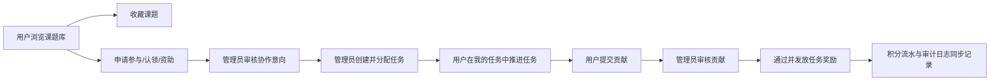

# 用户空间与管理员空间协作生命周期执行文档

日期：2026-06-09

分支：`codex/homepage-hero-motion`

## 1. 本分支交付目标

本分支把“用户空间”和“管理员空间”作为一个完整协作生命周期一次性交付，不再拆阶段。目标是让用户从浏览课题、收藏、申请参与、领取任务、提交贡献，到管理员审核、发放积分、查看审计记录形成闭环。

## 2. 设计原则

1. 充分复用现有数据库模型和 API 架构。
2. 不引入邮箱验证、邮箱重置密码等额外复杂流程。
3. 不新增冗余平行接口，只补当前生命周期真实缺口。
4. 管理员操作必须留下审计记录。
5. 用户界面必须兼容不同分辨率，不出现顶部栏、弹窗、表格或卡片内容溢出。

## 3. 已复用的现有能力

| 能力 | 复用位置 | 说明 |
| --- | --- | --- |
| 用户身份和 UID | `accounts.UserProfile` | 继续使用唯一 UID、身份、积分、声誉和资料字段 |
| 课题库 | `projects.Project` | 课题仍来自数据库 |
| 主题文件域 | `Theme`、`ThemeFile` | 课题详情继续展示所属主题文件域 |
| 收藏/评分/参与/认领/资助 | `interactions` app | 继续使用现有 interaction 模型 |
| 任务 | `ProjectTask` | 本次接通 API 和前端 |
| 贡献 | `Contribution` | 本次接通 API 和前端 |
| 积分流水 | `CreditLedger` | 任务奖励和用户积分明细复用该表 |
| 审计 | `AuditLog` | 管理动作、任务状态、贡献审核、用户撤回写入审计 |

## 4. 新增或扩展的 API

### 4.0 非必要接口和代码审查结论

- 后端保留本节列出的生命周期 HTTP API：它们分别对应用户空间、管理员空间、权限校验、审计和任务流转，不属于冗余接口。
- 前端 `api.js` 只保留当前页面实际调用的方法；暂未使用的贡献列表、积分列表、管理员详情等包装方法不在前端暴露，避免维护时误以为已有独立 UI 入口。
- 生命周期接口中凡是涉及人员展示，除管理员用户管理页外，统一只返回或展示 UID；协作、任务、贡献、积分和审计响应不得向普通生命周期界面暴露用户名、邮箱或真实姓名。
- 管理员用户管理页仍可展示用户名和邮箱，因为该页面承担账号检索、默认密码恢复和账号状态管理职责。

### 4.1 课题库状态悬浮卡

- `GET /api/projects/{project_id}/status-card/`

用于课题列表 hover/focus 小窗。访客只能看到参与者数量；登录用户可看到已确认参与者 UID 列表，且只展示 UID，不展示姓名、邮箱或用户名。

### 4.2 用户空间

- `GET /api/me/dashboard/`
- `GET /api/me/tasks/`
- `PATCH /api/me/tasks/{task_id}/status/`
- `GET /api/me/contributions/`
- `POST /api/me/contributions/`
- `GET /api/me/credits/`
- `PATCH /api/me/interactions/{type}/{interaction_id}/withdraw/`

`/api/me/dashboard/` 已扩展返回 `tasks`、`contributions`、`credits`，前端主入口仍复用 dashboard，避免重复请求。

### 4.3 管理员空间

- `GET /api/admin/overview/`
- `GET /api/admin/users/{uid}/`
- `GET /api/admin/interactions/`
- `PATCH /api/admin/interactions/{type}/{interaction_id}/status/`
- `GET /api/admin/tasks/`
- `POST /api/admin/tasks/`
- `GET /api/admin/tasks/{task_id}/`
- `PATCH /api/admin/tasks/{task_id}/`
- `DELETE /api/admin/tasks/{task_id}/`
- `POST /api/admin/tasks/{task_id}/assign/`
- `PATCH /api/admin/tasks/{task_id}/status/`
- `GET /api/admin/contributions/`
- `GET /api/admin/contributions/{contribution_id}/`
- `PATCH /api/admin/contributions/{contribution_id}/review/`
- `GET /api/admin/credits/`
- `GET /api/admin/audit-logs/`

这些接口都挂在既有 `NinjaAPI` 下，继续使用 Django session + CSRF。

## 5. 前端交付内容

### 5.1 用户空间

入口：`#/dashboard`

保留兼容：`#/favorites`

用户空间包含：

- 总览：收藏、申请、任务、积分概览。
- 我的收藏：集中查看和取消收藏课题。
- 我的申请：查看参与、认领、资助意向，并可撤回。
- 我的任务：查看管理员分配任务，展示任务状态、进度、当前参与 UID，标记开始并提交贡献。
- 我的贡献：提交贡献并查看审核结果。
- 积分流水：查看注册奖励、任务奖励等积分记录。
- 个人资料：维护身份、机构、邮箱、技能、研究兴趣等资料。

### 5.2 管理员空间

入口：`#/admin`

管理员空间包含：

- 总览：用户、课题、待审核协作、活跃任务、待审贡献、积分流水数量；卡片可点击进入对应子页面，hover 时轻微放大。
- 协作管理：包含“协作审核”和“审核后任务管理”两个功能；前者通过、记录或拒绝参与/认领/资助意向，后者展示已批准项目的人员 UID 状态并进入任务分配。
- 任务管理：创建任务、分配 UID、更新任务状态，并展示任务进度和参与 UID。
- 贡献审核：审核贡献，通过时可发放任务奖励。
- 课题管理：保留原有课题增删改和建任务入口。
- 主题与文件域：保留原有主题和文件域维护。
- 用户管理：保留系统统一默认密码恢复。
- 积分流水：按 UID 查看积分记录。
- 审计日志：查看管理动作和生命周期关键动作。
- JSON 导入与字段契约：保留原有能力。

### 5.3 课题卡 hover 小窗

用户浏览课题库时，鼠标悬停或键盘 focus 到课题卡，会展示：

- 收藏状态。
- 课题阶段。
- 已确认参与者数量。
- 登录用户可见参与者 UID 列表。
- 访客只看到数量和“登录后可查看 UID”的提示。

## 6. 协作生命周期



## 7. 严格验收标准

### 7.1 API 验收

- 课题状态卡接口存在，访客不返回参与者 UID。
- 登录用户访问课题状态卡时，只返回参与者 UID，不返回用户名或邮箱。
- 普通用户访问管理员 overview、用户详情、协作管理、积分、审计接口必须返回 403。
- 管理员可以查看并审核参与、认领、资助意向。
- 协作审核后 interaction 状态必须更新。
- 协作审核必须写入 `AuditLog`。
- 协作管理必须展示已批准项目状态，并只用 UID 展示已批准人员状态。
- 用户只能撤回自己的 interaction，不能撤回他人的 interaction。
- 管理员可以创建任务、分配 UID、更新任务状态。
- 任务 API 必须返回 `progress_percent`、`participant_uids` 和 `assignee_uid`，涉及人员的字段只展示 UID。
- 协作、任务、贡献、积分、审计响应中的人员字段必须只返回 UID，不返回 username、email、real_name 或 contact_email。
- 用户 dashboard 必须返回自己被分配的任务。
- 用户提交贡献后，关联任务必须进入 `review`。
- 管理员审核贡献为通过且选择发放奖励时，必须增加用户积分。
- 同一个任务奖励不能重复发放。
- 积分发放必须写入 `CreditLedger`。
- 贡献审核必须写入 `AuditLog`。
- 管理员用户详情必须包含收藏、申请、任务、贡献和积分记录。
- 管理员审计日志可以按 action 和 target_type 查询。

### 7.2 前端验收

- 顶部导航登录后展示“我的空间”，不再拆成多个并列入口造成拥挤。
- `#/dashboard` 展示用户空间 tabs。
- 用户空间至少包含总览、我的收藏、我的申请、我的任务、我的贡献、积分流水、个人资料。
- 用户可在“我的申请”撤回自己的申请。
- 用户可在“我的任务”看到任务状态、进度、参与 UID，开始任务并进入贡献提交。
- 用户可在“我的贡献”提交贡献。
- 管理员空间至少包含总览、协作管理、任务管理、贡献审核、课题管理、主题与文件域、用户管理、积分流水、审计日志。
- 管理员总览卡片 hover 时有轻微放大反馈，点击“待审核协作”“活跃任务”“待审贡献”等卡片必须进入对应管理 tab。
- 管理员“协作管理”必须包含“协作审核”和“审核后任务管理”，后者展示已批准项目的人员 UID 状态和建任务入口。
- 管理员“任务管理”必须展示参与 UID、进度、状态和操作，不展示用户名作为人员标识。
- 管理员可以在课题管理中点击“建任务”进入任务创建。
- 课题卡 hover/focus 小窗在桌面和小屏下不遮挡主要操作、不溢出屏幕。
- 更新日志弹窗可以展示最新版本更新内容。

### 7.3 响应式验收

- 1040px 以下顶部栏切换为紧凑两行结构，品牌、导航和账户操作各自居中，不横向溢出。
- 980px 以下用户空间、管理员空间、任务列表、贡献列表全部单列展示。
- 640px 以下课题状态悬浮卡左右留边，不横向溢出。
- 表格行内容长文本必须换行，不撑破容器。

## 8. 自动化验收命令

```bash
conda run -n openmedailab python manage.py test api
node --check frontend/src/main.js
node --test frontend/src/api.test.js frontend/src/profileMenu.test.js frontend/src/release.test.js frontend/src/uiPlacement.test.js
python scripts/check_release_version.py
npm --prefix frontend run build
```

## 9. 浏览器手动验收路径

前端：

- `http://127.0.0.1:5173/#/`
- `http://127.0.0.1:5173/#/dashboard`
- `http://127.0.0.1:5173/#/admin`

后端 API 文档：

- `http://127.0.0.1:8000/api/docs`

重点手动检查：

1. 课题库卡片 hover 是否出现状态小窗。
2. 登录用户是否能看到参与者 UID。
3. 用户空间各 tab 是否能切换。
4. 管理员空间各 tab 是否能切换。
5. 管理员审核协作意向后，用户空间状态是否更新。
6. 管理员分配任务后，用户空间“我的任务”是否出现任务。
7. 用户提交贡献后，管理员“贡献审核”是否出现记录。
8. 审核通过并奖励后，用户积分流水是否出现任务奖励。

## 10. 当前交付结论

本分支已经把用户空间与管理员空间从“可浏览、可申请”的 MVP 状态推进到“可管理生命周期”的闭环状态。后续如果继续扩展，应优先考虑更细粒度任务协作、贡献附件上传、管理员备注结构化和通知机制，但这些不影响本分支交付。

## 11. PR 准备验收记录

验收日期：2026-06-09

已通过：

- `conda run -n openmedailab python manage.py test api accounts projects interactions credits`
- `node --test frontend/src/api.test.js frontend/src/profileMenu.test.js frontend/src/release.test.js frontend/src/uiPlacement.test.js`
- `node --check frontend/src/main.js`
- `node --check frontend/src/api.js`
- `python scripts/check_release_version.py`
- `git diff --check`
- Django 测试客户端读取 `/api/openapi.json`，确认版本为 `0.3.0`，并确认本分支新增生命周期接口存在、邮箱验证/邮箱重置接口不存在。

浏览器验收：

- 已登录管理员 `platform_admin` 检查 `#/`、`#/dashboard`、`#/admin`。
- 已检查 1440、1120、1040、900、390px 宽度下顶部栏不重叠、页面不横向溢出。
- 已修复管理员 tabs 在 1120、1040、900px 宽度下按钮超出可视范围的问题，改为自动换行。
- 已确认管理员总览、用户空间和课题库页面可加载，系统版本展示为 `v0.3.0`。

未执行：

- `npm --prefix frontend run build`：当前 shell 环境没有 `npm`、`pnpm`、`yarn` 或 `corepack`，且没有本地 `frontend/node_modules/.bin/vite`，因此无法在本机完成构建命令。待安装 Node 包管理器后需补跑。
