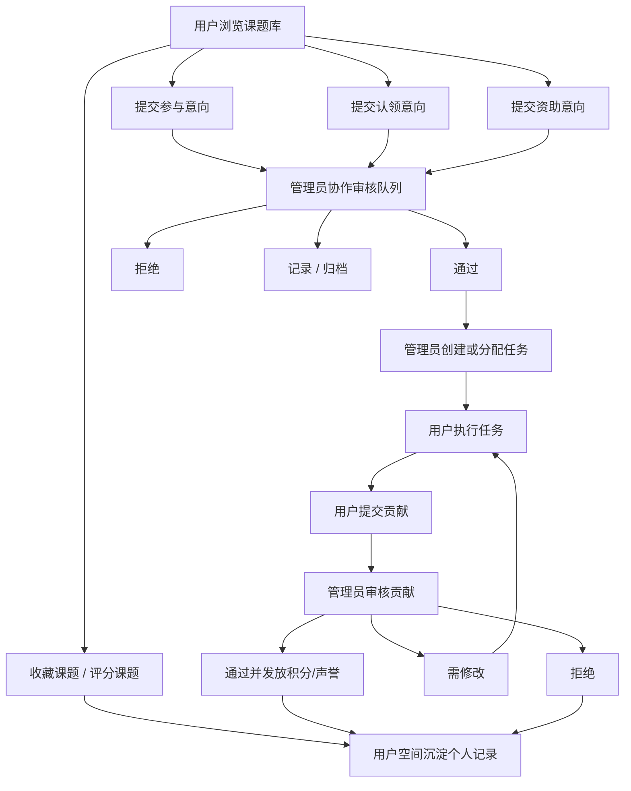

# 用户空间与管理员空间协作生命周期设计文档

生成日期：2026-06-09

适用仓库：`openmedailab-platform`

当前执行分支：`codex/homepage-hero-motion`

> 说明：本文保留早期设计推导和接口取舍讨论。当前分支已按“不再分阶段、一次性交付”的要求落地执行；最终执行范围、验收标准和测试命令以 `docs/user-admin-workspace-execution-and-acceptance.md` 为准。

## 1. 设计目标

本设计目标是把“用户空间”和“管理员空间”设计成一套完整的协作生命周期，而不是两个孤立页面。

系统应支持以下闭环：

```text
发现课题
  -> 收藏 / 评分 / 表达参与意向 / 认领工作 / 表达资助意向
  -> 用户空间跟踪全部个人行为和状态
  -> 管理员空间审核、分配、维护课题和任务
  -> 用户执行任务、提交贡献
  -> 管理员审核贡献、更新任务状态、发放积分或记录声誉
  -> 用户空间沉淀个人贡献、积分、声誉和历史记录
```

本轮设计必须优先复用当前已有 API、模型和前端路由。只有在已有接口无法表达审核、任务、贡献等状态流转时，才新增必要 API。

## 2. 当前代码基础

### 2.1 已有前端结构

当前前端主应用集中在：

- `frontend/src/main.js`
- `frontend/src/api.js`
- `frontend/src/styles.css`

当前已经存在的页面或视图：

| 视图 | 当前路由 | 当前能力 |
| --- | --- | --- |
| 课题库 | `#/`、`#/projects` | 课题搜索、主题筛选、阶段筛选、排序、收藏、打开详情 |
| 文件空间 | `#/space/:slug` | 查看主题文件域和关联课题 |
| 我的协作 | `#/dashboard` | 展示用户身份卡片和收藏/参与/评分数量 |
| 我的收藏 | `#/favorites` | 使用 dashboard 的 follows 展示收藏课题 |
| 管理 | `#/admin` | 课题、主题与文件域、用户、JSON 导入、字段契约 |
| 账号 | `#/login`、`#/register`、`#/password-change`、`#/password-reset` | 登录注册、强制改密、管理员恢复密码说明 |

### 2.2 已有后端模型

当前已有模型已经覆盖大部分协作生命周期：

| 模型 | 文件 | 可支持能力 |
| --- | --- | --- |
| `UserProfile` | `accounts/models.py` | UID、身份、机构、技能、积分、声誉、强制改密 |
| `Project` | `projects/models.py` | 课题核心结构化信息、阶段、评分、文件路径 |
| `Theme` | `projects/models.py` | 主题和主题文件域策略 |
| `ThemeFile` | `projects/models.py` | 主题数据资产、字典、伦理、模型资产等 |
| `ProjectDocument` | `projects/models.py` | 课题原始 Markdown/PDF/HTML 文件索引 |
| `ProjectFollow` | `interactions/models.py` | 用户收藏课题 |
| `ProjectScore` | `interactions/models.py` | 用户评分 |
| `ProjectInterest` | `interactions/models.py` | 参与意向 |
| `ProjectClaimIntent` | `interactions/models.py` | 认领意向 |
| `SponsorIntent` | `interactions/models.py` | 资助意向 |
| `ProjectTask` | `projects/models.py` | 任务拆分、认领、状态、参与 UID、积分奖励 |
| `Contribution` | `credits/models.py` | 用户提交贡献、管理员审核 |
| `CreditLedger` | `credits/models.py` | 注册奖励、任务奖励、资助池、管理员调整 |
| `AuditLog` | `projects/models.py` | 管理操作审计 |

### 2.3 已有后端 API

当前已有 API 可直接复用：

| 能力 | API | 是否复用 |
| --- | --- | --- |
| 当前用户 | `GET /api/me/` | 复用 |
| 用户资料 | `GET/PATCH/PUT /api/me/profile/` | 复用 |
| 用户 dashboard | `GET /api/me/dashboard/` | 已扩展复用 |
| 课题列表 | `GET /api/projects/` | 复用 |
| 课题详情 | `GET /api/projects/{id}/` | 复用 |
| 主题文件空间 | `GET /api/themes/{slug}/space/` | 复用 |
| 收藏 | `POST /api/projects/{id}/follow/` | 复用 |
| 取消收藏 | `POST/DELETE /api/projects/{id}/unfollow/` | 复用 |
| 评分 | `POST /api/projects/{id}/score/` | 复用 |
| 参与意向 | `POST /api/projects/{id}/interest/` | 复用 |
| 认领意向 | `POST /api/projects/{id}/claim/` | 复用 |
| 资助意向 | `POST /api/projects/{id}/sponsor/` | 复用 |
| 管理员用户列表 | `GET /api/admin/users/` | 复用 |
| 管理员恢复默认密码 | `POST /api/admin/users/{uid}/reset-password/` | 复用 |
| 管理主题 | `/api/admin/themes/` | 复用 |
| 管理主题文件 | `/api/admin/theme-files/` | 复用 |
| 管理课题 | `/api/admin/projects/` | 复用 |
| JSON 导入 | `POST /api/admin/projects/import-json/` | 复用 |

### 2.4 当前缺口

当前系统缺口不是“没有数据模型”，而是：

1. 用户空间仍偏统计摘要，没有把收藏、申请、认领、资助、评分、任务、贡献、积分流水串成个人工作台。
2. 管理员空间仍偏内容管理，没有把用户提交的参与/认领/资助意向变成可筛选、可审核、可分配的运营队列。
3. `ProjectTask`、`Contribution`、`CreditLedger` 已存在，但 API 和前端尚未接通。
4. `AuditLog` 已存在，但前端没有审计日志查看入口。
5. 当前执行已扩展 `GET /api/me/dashboard/`，用于承载用户空间的收藏、申请、任务、贡献和积分流水摘要。
6. 当前管理员没有 interaction 审核 API，无法把用户提交的 pending 状态改为 approved/rejected/recorded/withdrawn。
7. 当前课题列表只展示收藏数和参与数，没有面向单个课题的轻量状态卡数据，无法在 hover 时展示“当前用户收藏状态”和“已参与用户 UID 列表”。

## 3. 角色与权限设计

### 3.1 用户角色

现有 `RoleType` 已支持：

- 学生
- 医生
- 老师
- AI 工程师
- 医学统计
- 资助者
- 其他
- 管理员

### 3.2 RBAC 复用策略

当前 `api/rbac.py` 已有 capability：

| capability | 说明 |
| --- | --- |
| `browse_projects` | 浏览课题 |
| `view_theme_space` | 查看主题文件空间 |
| `maintain_profile` | 维护个人资料 |
| `follow_project` | 收藏课题 |
| `score_project` | 评分课题 |
| `express_interest` | 参与意向 |
| `claim_work` | 认领工作 |
| `sponsor_project` | 资助意向 |
| `view_dashboard` | 查看用户空间 |
| `manage_themes` | 管理主题和文件域 |
| `manage_projects` | 管理课题 |
| `manage_users` | 管理用户 |
| `import_projects` | 导入课题 |
| `view_admin_console` | 进入管理员空间 |

建议新增 capability：

| 新 capability | 使用范围 | 必要性 |
| --- | --- | --- |
| `review_interactions` | 审核参与、认领、资助意向 | 管理员需要处理协作申请 |
| `manage_tasks` | 创建、分配、更新任务 | 接通 `ProjectTask` |
| `review_contributions` | 审核用户贡献 | 接通 `Contribution` |
| `manage_credits` | 调整积分、发放任务奖励 | 接通 `CreditLedger` |
| `view_audit_logs` | 查看审计日志 | 运营追责和交接 |

这些 capability 默认仅管理员为 true，普通角色保持 false。后续如需项目负责人权限，可以再从管理员权限中拆分。

## 4. 协作生命周期

### 4.1 总流程



### 4.2 状态机

#### 4.2.1 参与/认领/资助意向状态

复用 `InteractionStatus`：

| 状态 | 中文 | 含义 | 用户可见 | 管理员动作 |
| --- | --- | --- | --- | --- |
| `pending` | 待处理 | 用户已提交，管理员未处理 | 是 | 通过、拒绝、记录 |
| `approved` | 已通过 | 管理员认可该意向 | 是 | 可转任务或团队成员 |
| `rejected` | 已拒绝 | 管理员拒绝 | 是 | 可填写拒绝原因 |
| `recorded` | 已记录 | 资助/线下沟通等已记录 | 是 | 归档记录 |
| `withdrawn` | 已撤回 | 用户或管理员撤回 | 是 | 仅归档 |

当前模型没有 `review_comment`、`reviewer`、`reviewed_at` 字段。当前分支可先只改 `status` 并写入 `AuditLog`；如果需要在用户空间展示审核原因，则需要为三个 interaction 模型新增统一审核字段，或者新增独立 `InteractionReviewLog`。

建议当前分支不改模型字段，先用 `AuditLog.after` 记录：

```json
{
  "status": "approved",
  "review_note": "已联系用户加入课题组"
}
```

如果用户端必须看到审核备注，再进入后续增强增加字段。

#### 4.2.2 任务状态

复用 `ProjectTask.TaskStatus`：

| 状态 | 中文 | 触发方 | 含义 |
| --- | --- | --- | --- |
| `todo` | 待认领 | 管理员 | 任务已创建，尚未分配 |
| `claimed` | 已认领 | 管理员/用户 | 已有参与 UID |
| `in_progress` | 进行中 | 管理员/用户 | 任务正在执行 |
| `review` | 待审核 | 用户 | 用户提交贡献，等待审核 |
| `done` | 已完成 | 管理员 | 贡献通过，任务完成 |
| `cancelled` | 已取消 | 管理员 | 任务取消 |

#### 4.2.3 贡献状态

复用 `ContributionStatus`：

| 状态 | 中文 | 触发方 | 含义 |
| --- | --- | --- | --- |
| `submitted` | 已提交 | 用户 | 用户提交成果 |
| `approved` | 已通过 | 管理员 | 审核通过，可发放积分 |
| `rejected` | 已拒绝 | 管理员 | 审核拒绝 |
| `needs_revision` | 需修改 | 管理员 | 需要用户修改后重新提交 |

## 5. 用户空间设计

### 5.1 信息架构

建议将顶部导航中的“我的协作”和“我的收藏”合并为“我的空间”，避免入口碎片化。

路由建议：

| 页面 | 路由 | 是否新增 |
| --- | --- | --- |
| 我的空间总览 | `#/workspace` | 新增 |
| 我的收藏 | `#/workspace/favorites` 或空间内 tab | 可复用现有 `#/favorites` |
| 我的申请 | `#/workspace/applications` 或空间内 tab | 新增 tab |
| 我的任务 | `#/workspace/tasks` 或空间内 tab | 当前已接入 |
| 我的贡献 | `#/workspace/contributions` 或空间内 tab | 当前已接入 |
| 积分流水 | `#/workspace/credits` 或空间内 tab | 当前已接入 |
| 个人资料 | `#/workspace/profile` 或空间内 tab | 新增 tab，复用 profile API |

兼容策略：

- 保留 `#/dashboard`，重定向或渲染到 `#/workspace`。
- 保留 `#/favorites`，重定向或渲染到用户空间的“我的收藏”tab。
- 顶部个人 hover 小窗点击用户名进入 `#/workspace`。

### 5.2 用户空间总览

总览展示：

- 用户身份卡：头像区域、昵称、用户名、UID、身份、机构、职称。
- 资料完整度：机构、研究兴趣、技能、可投入时间、联系方式是否填写。
- 关键指标：
  - 收藏课题数。
  - 待处理申请数。
  - 已通过申请数。
  - 进行中任务数。
  - 待修改贡献数。
  - 积分余额。
  - 声誉分。
- 下一步行动：
  - 完善资料。
  - 查看待处理申请。
  - 查看进行中任务。
  - 去课题库发现新课题。

当前分支数据来源：

- 扩展后的 `GET /api/me/dashboard/`
- `GET /api/me/`

当前同时保留的明细 API：

- `GET /api/me/tasks/`
- `GET /api/me/contributions/`
- `GET /api/me/credits/`

### 5.3 我的收藏

功能：

- 展示所有收藏课题。
- 打开课题详情或预览。
- 取消收藏。
- 支持按主题、阶段、关键词过滤。
- 空状态引导回课题库。

API：

当前分支复用：

- `GET /api/me/dashboard/` 的 `follows`
- `POST /api/projects/{id}/unfollow/`

后续当收藏数量变大时再新增：

- `GET /api/me/follows/?q=&theme=&stage=&page=&page_size=`

### 5.4 我的申请

合并展示三类申请：

- 参与意向：`ProjectInterest`
- 认领意向：`ProjectClaimIntent`
- 资助意向：`SponsorIntent`

字段：

- 类型：参与 / 认领 / 资助。
- 课题标题、课题编号、主题、阶段。
- 角色或类型。
- 用户填写说明。
- 当前状态和状态文案。
- 创建时间和更新时间。
- 可操作：查看课题、撤回申请。

API：

当前分支复用：

- `GET /api/me/dashboard/`

当前新增：

- `POST /api/me/interactions/{type}/{id}/withdraw/`

新增理由：

- 当前模型有 `withdrawn` 状态，但没有用户撤回 API。
- 撤回是用户空间闭环的自然动作，不能由重新提交覆盖。

### 5.5 我的任务

当前执行已接入 `ProjectTask`，作为协作审核后的实际交付空间。

功能：

- 展示分配给当前用户的任务。
- 按状态分组：待开始、进行中、待审核、已完成。
- 展示任务进度、任务状态、当前参与 UID；涉及人员一律只展示 UID。
- 查看任务详情：课题、说明、角色要求、截止日期、积分奖励。
- 用户可提交贡献。

当前 API：

- `GET /api/me/tasks/?status=&project=&page=&page_size=`
- `PATCH /api/me/tasks/{task_id}/status/`
- `POST /api/me/contributions/`

说明：

- `POST /api/me/contributions/` 可创建 `Contribution`，并把任务状态改为 `review`。
- 不建议用户直接改任务任意字段。

### 5.6 我的贡献

当前执行已接入 `Contribution`。

功能：

- 展示当前用户全部贡献。
- 查看审核状态、审核意见。
- 对 `needs_revision` 的贡献重新提交。
- 查看通过后获得的积分和声誉变化。

当前 API：

- `GET /api/me/contributions/?status=&project=&page=&page_size=`
- `POST /api/me/contributions/`

边界：

- 用户只能查看和修改自己的贡献。
- 已通过或已拒绝的贡献不可随意编辑。

### 5.7 积分与声誉

当前执行已接入 `CreditLedger`。

功能：

- 展示当前积分余额。
- 展示积分流水：注册奖励、任务奖励、资助池、管理员调整。
- 每条流水展示来源课题、任务、原因、创建人。

当前 API：

- `GET /api/me/credits/?page=&page_size=`

说明：

- 用户只能看自己的积分流水。
- 声誉分可以先保留在 `UserProfile.reputation_score`，后续再设计声誉流水。

### 5.8 个人资料

功能：

- 编辑昵称、真实姓名、身份、机构、职称。
- 编辑研究兴趣、技能、每周可投入时间、邮箱、微信、个人简介。
- 展示 UID，不允许修改。
- 展示邮箱唯一性错误。

API：

- `GET /api/me/profile/`
- `PATCH /api/me/profile/`

实现建议：

- 当前已有 API，可以直接复用。
- 前端需要把资料编辑从认证页面中独立出来，放入用户空间。

## 6. 管理员空间设计

### 6.1 信息架构

建议将当前“内容管理工作台”升级为“管理员空间”。

主 tab 建议：

| Tab | 功能 | 当前基础 |
| --- | --- | --- |
| 总览 | 待处理事项、近期更新、异常用户、快捷入口 | 新增 |
| 协作管理 | 协作审核；审核后任务管理；已批准项目人员 UID 状态 | 需新增/复用 API |
| 课题管理 | 课题列表、编辑、归档 | 已有 |
| 任务管理 | 创建、分配、更新任务 | 需接入 `ProjectTask` |
| 贡献审核 | 审核用户贡献，发放积分 | 需接入 `Contribution`、`CreditLedger` |
| 主题与文件域 | 主题、文件域维护 | 已有 |
| 用户管理 | 用户查询、默认密码恢复、用户详情 | 已有，需增强用户详情 |
| JSON 导入 | 导入课题 | 已有 |
| 审计日志 | 查看管理员操作 | 需新增查询 API |
| 字段契约 | 查看字段契约 | 已有 |

### 6.2 管理总览

展示：

- 待审核参与意向数量。
- 待审核认领意向数量。
- 待审核资助意向数量。
- 待审核贡献数量。
- 进行中任务数量。
- 最近更新课题数量。
- 待修改默认密码用户数量。
- 最近审计日志。

当前 API：

- `GET /api/admin/overview/`

- 新增 `GET /api/admin/overview/`，因为总览需要跨表聚合，后端一次性聚合更稳定。

### 6.3 协作审核

这是当前分支已补上的关键缺口。

功能：

- 筛选类型：参与 / 认领 / 资助 / 全部。
- 筛选状态：待处理 / 已通过 / 已拒绝 / 已记录 / 已撤回。
- 筛选课题、主题、用户、关键词。
- 查看申请详情。
- 操作：通过、拒绝、记录、撤回。
- 填写审核备注。
- 审核后写入 `AuditLog`。

当前 API：

```text
GET   /api/admin/interactions/?type=&status=&project=&theme=&user=&q=&page=&page_size=
PATCH /api/admin/interactions/{type}/{id}/status/
```

`type` 取值：

- `interest`
- `claim`
- `sponsor`

`PATCH` payload：

```json
{
  "status": "approved",
  "review_note": "已通过，后续安排任务"
}
```

返回：

```json
{
  "type": "interest",
  "item": {
    "id": 1,
    "status": "approved",
    "status_label": "已通过"
  }
}
```

为什么必须新增：

- 当前用户可以提交 pending，但管理员没有 API 修改状态。
- 没有这个能力，协作生命周期无法从“申请”进入“任务/团队”。

### 6.4 课题管理增强

保留已有能力：

- `GET /api/admin/projects/`
- `GET /api/admin/projects/{id}/`
- `POST /api/admin/projects/`
- `PATCH /api/admin/projects/{id}/`
- `DELETE /api/admin/projects/{id}/`
- `POST /api/admin/projects/import-json/`

增强方向：

- 在课题详情管理视图中增加“协作侧栏”：
  - 参与意向数量。
  - 认领意向数量。
  - 资助意向数量。
  - 任务数量。
  - 贡献数量。
- 在课题编辑页可以进入该课题的审核队列。
- 项目阶段变更要保留审计。

当前分支无需新增平行 API：

- 使用 admin interactions API 按 `project` 筛选。

### 6.5 任务管理

当前执行已接入 `ProjectTask`。任务管理用于把“已通过的协作意向”继续拆成可交付任务，而不是替代协作审核。

功能：

- 创建任务。
- 编辑任务。
- 按课题、状态、参与 UID、角色筛选任务。
- 分配参与 UID。
- 展示任务状态、进度、参与 UID 和积分奖励。
- 将任务标记为进行中、待审核、完成、取消。
- 任务关联积分奖励。

当前 API：

```text
GET   /api/admin/tasks/?project=&status=&assignee=&q=&page=&page_size=
POST  /api/admin/tasks/
GET   /api/admin/tasks/{task_id}/
PATCH /api/admin/tasks/{task_id}/
DELETE /api/admin/tasks/{task_id}/
POST  /api/admin/tasks/{task_id}/assign/
PATCH /api/admin/tasks/{task_id}/status/
```

边界：

- 删除任务建议软删除：设置 `cancelled`。
- 分配 UID 必须对应已注册用户。
- 任务状态变更必须写 `AuditLog`。

### 6.6 贡献审核

当前执行已接入 `Contribution`。

功能：

- 查看待审核贡献。
- 按课题、任务、用户、状态筛选。
- 查看提交说明和文件路径。
- 审核通过、拒绝、要求修改。
- 通过后可发放积分。
- 通过后可将任务状态改为 `done`。

当前 API：

```text
GET   /api/admin/contributions/?status=&project=&task=&user=&page=&page_size=
GET   /api/admin/contributions/{id}/
PATCH /api/admin/contributions/{id}/review/
```

`review` payload：

```json
{
  "status": "approved",
  "review_comment": "通过",
  "grant_reward": true
}
```

通过时逻辑：

1. 更新 `Contribution.status=approved`。
2. 写入 `reviewer`、`review_comment`、`reviewed_at`。
3. 如关联 task 且 `grant_reward=true`，创建 `CreditLedger`。
4. 更新用户 `credit_balance`。
5. 可选增加 `reputation_score`。
6. 写入 `AuditLog`。

### 6.7 用户管理增强

保留已有能力：

- `GET /api/admin/users/`
- `POST /api/admin/users/{uid}/reset-password/`

新增展示：

- 用户详情抽屉。
- 资料信息。
- 收藏数。
- 参与/认领/资助记录。
- 任务记录。
- 贡献记录。
- 积分流水。
- 默认密码状态。

当前 API：

```text
GET /api/admin/users/{uid}/
```

返回内容：

- `user_payload`
- dashboard 摘要。
- 最近申请。
- 最近任务。
- 最近贡献。
- 最近积分流水。

为什么新增：

- 当前 `GET /api/admin/users/` 是列表接口，不适合塞大量关联数据。
- 用户详情是管理员空间常用入口，独立接口更清晰。

### 6.8 审计日志

当前已有 `AuditLog`，本分支补充只读 API。

当前 API：

```text
GET /api/admin/audit-logs/?actor=&action=&target_type=&target_id=&page=&page_size=
```

功能：

- 管理员查看关键操作历史。
- 支持按用户、动作、目标类型、目标 ID 筛选。
- 前端只读，不提供删除。

## 7. API 复用与新增边界

### 7.1 当前分支必须复用的 API

| 功能 | API |
| --- | --- |
| 用户空间总览 | `GET /api/me/dashboard/`、`GET /api/me/` |
| 用户资料 | `GET/PATCH /api/me/profile/` |
| 收藏课题 | `POST /api/projects/{id}/follow/` |
| 取消收藏 | `POST/DELETE /api/projects/{id}/unfollow/` |
| 评分 | `POST /api/projects/{id}/score/` |
| 参与意向 | `POST /api/projects/{id}/interest/` |
| 认领意向 | `POST /api/projects/{id}/claim/` |
| 资助意向 | `POST /api/projects/{id}/sponsor/` |
| 管理课题 | `/api/admin/projects/` |
| 管理主题 | `/api/admin/themes/` |
| 管理文件域 | `/api/admin/theme-files/` |
| 管理用户 | `/api/admin/users/` |

### 7.2 当前分支新增的必要 API

| API | 用途 | 优先级 |
| --- | --- | --- |
| `GET /api/admin/interactions/` | 管理员查看参与/认领/资助队列 | P0 |
| `PATCH /api/admin/interactions/{type}/{id}/status/` | 管理员审核协作意向 | P0 |
| `GET /api/admin/overview/` | 管理员总览聚合统计 | P1 |
| `GET /api/projects/{id}/status-card/` | 课题库 hover 状态卡，返回收藏状态和已参与用户 UID 摘要 | P1 |
| `POST /api/me/interactions/{type}/{id}/withdraw/` | 用户撤回自己的申请 | P1 |
| `GET /api/admin/audit-logs/` | 查看审计日志 | P1 |
| `GET /api/admin/users/{uid}/` | 管理员查看用户详情 | P1 |

### 7.3 当前分支已接入的任务、贡献和积分 API

| API | 用途 |
| --- | --- |
| `GET /api/me/tasks/` | 用户查看自己的任务 |
| `PATCH /api/me/tasks/{id}/status/` | 用户更新自己的任务状态 |
| `GET /api/admin/tasks/` | 管理员任务列表 |
| `POST /api/admin/tasks/` | 管理员创建任务 |
| `GET /api/admin/tasks/{id}/` | 管理员查看任务详情 |
| `PATCH /api/admin/tasks/{id}/` | 管理员编辑任务 |
| `DELETE /api/admin/tasks/{id}/` | 管理员取消任务 |
| `POST /api/admin/tasks/{id}/assign/` | 管理员分配任务 |
| `PATCH /api/admin/tasks/{id}/status/` | 管理员更新任务状态 |
| `GET /api/me/contributions/` | 用户查看贡献 |
| `POST /api/me/contributions/` | 用户提交贡献 |
| `GET /api/admin/contributions/` | 管理员查看贡献 |
| `PATCH /api/admin/contributions/{id}/review/` | 管理员审核贡献 |
| `GET /api/me/credits/` | 用户查看积分流水 |
| `GET /api/admin/credits/` | 管理员查看或筛选积分流水 |

## 8. 前端页面设计

### 8.1 导航

建议顶部导航：

```text
课题库 | 文件空间 | 我的空间 | 管理
```

登录用户显示“我的空间”。管理员额外显示“管理”。

兼容：

- `#/dashboard` 仍可访问，但展示“我的空间”总览。
- `#/favorites` 仍可访问，但展示“我的空间 - 我的收藏”。

### 8.2 课题库状态悬浮卡

在用户浏览课题库时，每个课题列表项应支持一个轻量状态悬浮卡。鼠标移入课题卡片后显示；键盘 focus 时也应显示；移动端不依赖 hover，改为点击“状态”按钮打开。

#### 展示内容

悬浮卡只展示和当前课题状态相关的轻量信息：

- 当前用户收藏状态：
  - 未登录：`登录后可收藏`。
  - 已登录且未收藏：`未收藏`。
  - 已登录且已收藏：`已收藏`。
- 参与状态摘要：
  - 已参与用户 UID 列表。
  - 只展示 UID，不展示用户名、昵称、邮箱、机构、微信、真实姓名。
  - 默认最多展示 8 个 UID，超出时显示 `+N`。
  - 没有已参与用户时显示 `暂无已参与用户`。
- 当前用户与该课题的关系：
  - 是否已提交参与意向。
  - 是否已提交认领意向。
  - 是否已提交资助意向。
  - 是否已评分。
- 课题阶段：
  - 使用现有 `stage_label`。
- 快捷操作：
  - 收藏 / 取消收藏。
  - 查看详情。
  - 已登录用户可进入提交参与意向区域。

#### 参与用户 UID 的定义

“已参与用户 UID”不是所有提交过申请的用户，而是已经进入协作状态的用户。当前定义为：

- `ProjectInterest.status = approved` 的用户。
- `ProjectClaimIntent.status = approved` 的用户。
- `SponsorIntent.status = approved` 或 `recorded` 的用户。

任务和贡献闭环接入后，再补充：

- `ProjectTask.assignee` 不为空且任务状态不是 `cancelled` 的用户。
- `Contribution.status = approved` 的贡献用户。

所有 UID 需要去重，只返回 `UserProfile.uid`。

#### 数据来源

可复用的现有数据：

- 当前用户收藏状态优先复用 `GET /api/me/dashboard/` 的 `follows`，与现有列表收藏逻辑保持一致。
- 当前用户在课题详情里的关系可参考 `GET /api/projects/{id}/` 返回的 `viewer_state`。
- 课题阶段、收藏数、参与数等基础字段来自 `GET /api/projects/`。

必须新增的轻量 API：

```text
GET /api/projects/{id}/status-card/
```

新增理由：

- 当前 `GET /api/projects/` 只有统计数量，没有参与用户 UID。
- 当前 `GET /api/projects/{id}/` 有 `viewer_state` 和 `team_status`，但不返回 UID 列表。
- 直接在列表接口返回所有课题 UID 列表会增加 payload 和查询成本。
- hover 时按需请求单个课题状态，更符合性能和隐私边界。

建议响应：

```json
{
  "project_id": 119,
  "stage": "open_recruiting",
  "stage_label": "开放招募",
  "is_following": true,
  "viewer_state": {
    "is_following": true,
    "has_interest": true,
    "has_claim": false,
    "has_sponsor": false,
    "has_score": true
  },
  "participants": {
    "total": 12,
    "uids": ["S00000001", "D00000002", "E00000003"],
    "hidden_count": 9
  }
}
```

权限建议：

- 访客可以看到收藏数、参与人数、课题阶段，但不展示 UID 列表。
- 登录用户可以看到已参与用户 UID 列表。
- 管理员仍通过管理员空间查看完整用户资料，不在 hover 卡片中展示个人敏感信息。

#### 前端交互规则

- 鼠标移入课题卡片 150 到 250ms 后打开，避免快速扫过时频繁闪烁。
- 鼠标移出卡片和悬浮卡后关闭。
- 键盘 focus 到课题卡片或状态按钮时打开，按 `Escape` 关闭。
- 移动端显示一个“状态”小按钮，点击打开小弹层，再点击外部关闭。
- 状态卡不遮挡收藏按钮和详情按钮。
- 状态卡宽度控制在 280 到 360px。
- 卡片内 UID 使用等宽或 tabular 数字样式，便于扫描。
- 长 UID 不允许撑破容器。
- API 返回前显示轻量加载态。
- API 失败时显示“状态暂不可用”，不能影响课题列表浏览。
- 同一个课题状态卡数据在本次页面会话内缓存，收藏或申请操作成功后局部刷新或更新缓存。

#### 隐私与安全规则

- 悬浮卡只展示 UID，不展示用户名、邮箱、昵称、机构、真实姓名、微信。
- 未登录访客不展示 UID 列表。
- 不展示 pending 申请人的 UID，避免把用户意向在审核前公开。
- 被拒绝、撤回的申请不计入参与 UID。
- 管理员如需查看申请人详情，应进入“管理员空间 / 协作审核”。
- 状态卡 API 不允许返回用户内部数据库 ID。

### 8.3 用户空间布局

页面结构：

```text
用户空间
  顶部身份摘要
  指标概览
  Tab:
    总览
    我的收藏
    我的申请
    我的任务
    我的贡献
    积分流水
    个人资料
```

设计原则：

- 不做营销式大 hero。
- 使用紧凑 dashboard 布局。
- 卡片半径保持 8 到 12px。
- 关键列表一行一个，便于扫描。
- 移动端 tab 自动换行，不能横向溢出。

### 8.4 管理员空间布局

页面结构：

```text
管理员空间
  顶部运营总览
  Tab:
    总览
    协作管理
    课题管理
    任务管理
    贡献审核
    主题与文件域
    用户管理
    JSON 导入
    审计日志
    字段契约
```

设计原则：

- 管理台应更像工作台，减少装饰。
- 列表、筛选、批量处理优先。
- 每个 tab 有清晰空状态和失败态。
- 审核、恢复密码、归档等危险动作必须二次确认。
- 审核成功后显示明确反馈，并刷新对应列表行。

## 9. 数据一致性与业务规则

### 9.1 用户提交规则

- 未登录用户不能提交收藏、评分、参与、认领、资助。
- 强制改密用户不能进入业务空间，继续复用现有 `PasswordChangeRequiredMiddleware`。
- 同一用户对同一课题同一角色/类型只能有一条记录，复用现有唯一约束。
- 重复提交时复用 `update_or_create` 更新原记录，并重置为 `pending`。

### 9.2 管理员审核规则

- 只有 `review_interactions` 为 true 的用户可以审核申请。
- 只有平台唯一管理员默认拥有该权限。
- 审核状态必须是 `InteractionStatus` 合法值。
- 审核动作必须写入 `AuditLog`。
- 普通用户访问审核接口返回 `403 permission_denied`。

### 9.3 任务规则

- 任务必须归属课题。
- 任务分配 UID 必须对应注册用户。
- 任务从 `todo` 到 `claimed/in_progress/review/done/cancelled`。
- 用户只能操作分配给自己的任务。
- 管理员可以调整任务状态，但必须写审计。

### 9.4 贡献与积分规则

- 贡献必须归属用户和课题，可选关联任务。
- 用户只能查看自己的贡献。
- 管理员审核通过后才能发放积分。
- 积分流水必须事务化写入，避免余额和流水不一致。
- 积分变更必须记录 `created_by`。

### 9.5 课题状态悬浮卡规则

- 状态卡不得改变课题生命周期状态，只负责展示和跳转。
- 状态卡的收藏按钮复用现有 follow/unfollow API。
- 状态卡的 UID 列表只来自已通过或已记录的协作关系。
- 状态卡 API 必须避免 N+1 查询，后端应一次性预取 profile 并只投影 UID。
- 状态卡数据可以短时间缓存，但收藏、申请、审核动作完成后必须刷新或失效对应课题缓存。
- 状态卡不能成为管理员审核入口，审核入口只能在管理员空间中出现。

## 10. 本分支落地范围

当前分支已按一次性交付口径落地，不再拆分阶段。已完成范围：

- 将 `#/dashboard` 升级为“我的空间”。
- 用户可看到收藏、申请、评分等完整列表。
- 管理员可在“协作管理”中审核参与/认领/资助意向，并查看审核后项目人员 UID 状态。
- 审核结果回流用户空间。
- 接通 `ProjectTask`。
- 用户可查看任务并提交贡献。
- 管理员可审核贡献并完成任务。
- 接通积分流水。
- 管理员可查看操作审计和积分流水。
- 用户可看到自己的积分来源。
- 课题卡 hover/focus 状态卡展示当前用户状态、课题参与状态和人员 UID，所有涉及人员的信息只展示 UID。
- 管理员总览卡片支持 hover 放大和点击进入对应子页面。

仍建议后续增强但不阻塞当前交付的能力：

- 贡献附件真实上传和对象存储。
- 站内通知、邮件通知或消息中心。
- 更细粒度的项目负责人权限。
- 更复杂的任务依赖、里程碑和多人协作进度。

## 11. 文档与版本更新规则

每次可交付更新必须：

1. 更新 `CHANGELOG.md`。
2. 更新系统版本号。
3. 更新 `/api/docs` 中新增接口说明。
4. 更新本设计文档或新增实施文档。
5. 在 PR 描述中说明：
   - 新增功能。
   - 复用 API。
   - 新增 API。
   - 测试结果。
   - 已知限制。

当前版本：

- 用户空间、管理员空间和协作生命周期闭环：`0.3.0`。

## 12. 严格验收标准

### 12.1 用户空间验收

- 登录用户能进入“我的空间”。
- 未登录用户进入用户空间会跳转登录。
- 强制改密用户不能访问用户空间。
- 用户空间显示 UID、身份、机构、积分、声誉。
- “我的收藏”展示 `GET /api/me/dashboard/` 中的 follows。
- 用户取消收藏后，收藏页和课题库状态一致。
- “我的申请”展示 interest、claim、sponsor 三类记录。
- 每条申请显示类型、课题、状态、更新时间。
- 申请状态被管理员修改后，用户空间能看到最新状态。
- 课题库列表鼠标 hover 或键盘 focus 时能打开课题状态悬浮卡。
- 状态悬浮卡能展示当前用户收藏状态。
- 登录用户能在状态悬浮卡中看到已参与用户 UID 列表。
- 访客只能看到参与人数，不展示 UID 列表。
- 空状态、加载态、失败态都有明确文案。
- 移动端无横向溢出。

### 12.2 管理员空间验收

- 普通用户看不到“管理”入口。
- 普通用户访问 admin space 或 admin API 返回 403。
- 管理员能进入管理员空间。
- 管理员能看到协作审核队列。
- 管理员能按类型、状态、课题或关键词筛选申请。
- 管理员能将 pending 申请改为 approved/rejected/recorded。
- 每次审核会写入 `AuditLog`。
- 管理端审核后列表状态立即刷新。
- 管理员不能通过用户管理恢复自己的默认密码，保留现有规则。

### 12.3 任务与贡献验收

- 管理员能创建任务并分配用户。
- 用户只能看到分配给自己的任务。
- 用户能提交贡献。
- 管理员能审核贡献为 approved/rejected/needs_revision。
- 贡献通过后，任务可变为 done。
- 发放积分时，`UserProfile.credit_balance` 和 `CreditLedger` 一致。
- 任务、贡献、积分关键动作写入 `AuditLog`。

### 12.4 API 验收

- 新增接口全部出现在 `/api/docs`。
- `GET /api/projects/{id}/status-card/` 返回课题阶段、当前用户收藏状态、当前用户关系摘要和参与 UID 摘要。
- 未登录访问 `GET /api/projects/{id}/status-card/` 时不返回 UID 列表。
- 登录用户访问 `GET /api/projects/{id}/status-card/` 时只返回 UID，不返回用户名、邮箱、昵称、机构、微信或真实姓名。
- API 响应保持当前 envelope：
  - 成功：`{"ok": true, "data": ...}`
  - 失败：`{"ok": false, "error": ...}`
- 权限失败返回 `403 permission_denied`。
- 未登录返回 `401 auth_required`。
- 非法状态返回 `422 validation_error`。
- 所有写接口继续使用 CSRF。

### 12.5 前端验收

- 顶部导航在桌面、平板、手机自适应。
- 用户空间 tabs 不溢出。
- 管理员空间 tabs 不溢出。
- 课题状态悬浮卡不遮挡收藏按钮、详情按钮和列表主要内容。
- 课题状态悬浮卡支持 hover、focus、Escape 关闭和移动端点击打开。
- 课题状态悬浮卡加载失败时不影响课题列表使用。
- 审核、恢复密码、归档等危险动作必须有确认。
- 所有异步操作有加载或禁用状态。
- 所有成功/失败操作有明确反馈。
- 长标题、长用户名、长邮箱、长课题名不会撑破布局。

### 12.6 测试验收

后端至少新增：

- 普通用户不能访问 admin interaction API。
- 管理员可以筛选 pending 申请。
- 管理员可以审核 interest/claim/sponsor。
- 审核后用户 dashboard 返回最新状态。
- 审核写入 `AuditLog`。
- 非法状态返回 422。

前端至少新增：

- 用户空间从 dashboard 渲染收藏和申请。
- 管理员空间协作管理 tab 渲染待审核申请。
- 审核按钮调用正确 API。
- 审核成功后状态文案更新。
- 移动端 tab 布局不横向溢出。

## 13. 不建议当前分支做的事情

以下能力暂不建议当前分支做：

- 复杂组织架构和多管理员角色。
- 项目负责人独立权限体系。
- 文件真实上传和对象存储。
- 实时消息、站内信、邮件通知。
- 复杂积分商城。
- 公开排行榜。
- 多租户机构空间。

这些能力可以后续扩展，但不应该阻塞当前“用户空间 + 管理员空间 + 协作生命周期”闭环落地。

## 14. 最终建议

当前分支优先交付：

```text
我的空间完整化 + 管理员协作管理中心 + 任务贡献闭环
```

原因：

- 最大程度复用现有 `GET /api/me/dashboard/` 和现有 interaction 模型。
- 新增 API 数量少，但能补上协作生命周期最关键的一环。
- 用户能看到自己做过什么、现在到哪一步。
- 管理员能处理用户提交的申请，系统从“展示课题”进入“协作运营”。

当前分支已接入 `ProjectTask`、`Contribution` 和 `CreditLedger`，任务、贡献、积分闭环已作为本轮交付范围完成。
